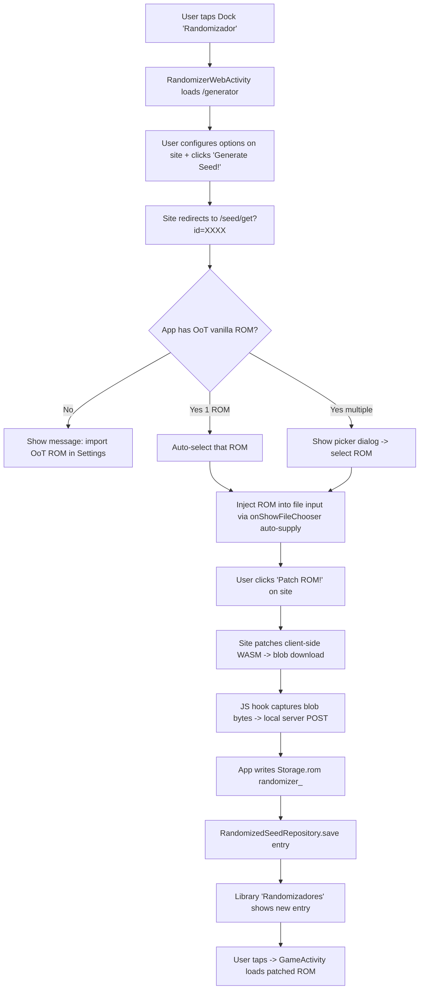

# Plano do Projeto: Zelda 64 Player

## Visão Geral e Filosofia

**Zelda 64 Player** é um aplicativo Android nativo (Kotlin) derivado do projeto **Ludere** (fork de Swordfish90/Ludere, licenciado sob GPL-3.0), customizado como pacote `br.com.redclaw.ootdx` com nome "Zelda 64".

### Mudança Filosófica Central: **Nenhuma ROM Embutida**

O aplicativo **NUNCA** distribui, baixa ou inclui ROMs base (Ocarina of Time, Majora's Mask). O usuário **deve** fornecer suas próprias ROMs legalmente obtidas via tela de configurações. O app aplica patches BPS (fornecidos pela "Loja de Hacks") sobre a ROM base do usuário **em memória ou em arquivo de cache** antes de passar ao core Libretro.

**Legalidade**: Apenas patches (BPS) e metadados são distribuídos pelo app. ROMs base permanecem responsabilidade do usuário.

---

## Arquitetura Proposta

### Padrão Arquitetural
- **MVC adaptado para Android**: `View` (Activities/Fragments + ViewBinding), `ViewModel` (AndroidViewModel + LiveData/Flow), `Model` (Repositories + Use Cases)
- **Modularização por feature**: pacotes coesos por responsabilidade
- **Injeção de dependência manual** (sem Dagger/Hilt para manter leve; `Application` como Service Locator simples)

### Estrutura de Pacotes (Kotlin)

```
br.com.redclaw.zelda64player
├── data/                    # Modelos de dados imutáveis + catálogo local
│   ├── model/
│   │   ├── BaseRom.kt       # ROM base do usuário (checksums, path, metadados header)
│   │   ├── HackEntry.kt     # Entrada da loja (nome, descrição, URL patch, checksums requeridos)
│   │   ├── HackCatalog.kt   # Catálogo completo (lista de HackEntry + versão do catálogo)
│   │   └── PatchFile.kt     # Patch BPS baixado (bytes, checksum, path local)
│   └── local/
│       ├── BaseRomRepository.kt      # CRUD ROMs base do usuário (Room ou JSON simples)
│       ├── PatchRepository.kt        # Patches baixados (arquivos em cacheDir)
│       └── CatalogRepository.kt      # Catálogo remoto + cache local (ETag/Last-Modified)
├── patcher/                 # Módulo PURO Kotlin (sem dependências Android)
│   ├── bps/
│   │   ├── BpsPatch.kt            # Modelo do patch parseado (header, commands, checksums)
│   │   ├── BpsParser.kt           # Parser streaming (varint, commands)
│   │   ├── BpsApplier.kt          # Aplicador streaming (source/target copy/read)
│   │   ├── BpsValidator.kt        # Valida CRC32 source/target/patch
│   │   └── VarInt.kt              # Codificação/decodificação varint (LEB128-like)
│   ├── n64/
│   │   ├── RomNormalizer.kt       # Detecta byte order (.z64/.n64/.v64) → normaliza para z64 (BE)
│   │   ├── RomHeader.kt           # Parse do header N64 (game ID "CZLE"/"NSME", version, CRC1/2)
│   │   └── ChecksumCalculator.kt  # CRC32 (IEEE), MD5, SHA-1 da ROM normalizada
│   └── PatcherFacade.kt           # API única: applyPatch(baseRom: File, patch: File): Result<File>
├── store/                   # Loja de Hacks (UI + lógica de download)
│   ├── ui/
│   │   ├── StoreActivity.kt
│   │   ├── StoreViewModel.kt
│   │   ├── HackListAdapter.kt
│   │   └── HackDetailBottomSheet.kt
│   ├── DownloadManager.kt         # Download com retry, progress, validação checksum patch
│   └── CatalogFetcher.kt          # Fetch JSON remoto + cache ETag/If-None-Match
├── settings/                # Configurações do usuário
│   ├── ui/
│   │   ├── SettingsActivity.kt
│   │   ├── BaseRomImportFragment.kt    # Importar ROMs base (file picker + validação)
│   │   ├── BaseRomListFragment.kt      # Lista ROMs importadas com checksums
│   │   └── CatalogUrlFragment.kt       # URLs de catálogo customizadas (extensão)
│   └── SettingsViewModel.kt
├── repositories/            # Persistência (Storage adaptado do Ludere)
│   ├── Storage.kt             # Paths por hackId: rom_<id>, sram_<id>, state_<id>
│   └── GameRomResolver.kt     # NOVO: Single ROM resolver (vanilla_* via BaseRomRepository; else Storage.rom)
├── retroview/               # Emulação (adaptado do Ludere)
│   ├── RetroView.kt           # PONTO DE INTERCEPTAÇÃO: carrega ROM patcheada do cache
│   └── RetroViewUtils.kt      # Save/load state, fast forward, preservação
├── views/                   # UI principal (Library + Game)
│   ├── LibraryActivity.kt     # Grid de hacks instalados (instalados = patch baixado + base ROM válida)
│   ├── GameActivity.kt        # Activity de jogo (inalterada exceto gameId → hackId)
│   ├── BaseRomLibrarySource.kt # NOVO: LibrarySource para ROMs base do usuário
│   └── viewmodels/
│       └── GameActivityViewModel.kt
├── gamepad/                 # Controles touch (RadialGamePad) - INALTERADO
├── input/                   # Mapeamento controle físico - INALTERADO
├── utils/                   # Utilitários - INALTERADO (CorePrefs, RetroViewUtils)
└── di/                        # Service Locator simples
    └── AppContainer.kt
```

### Escopo de Migração: Limpeza do Ludere

O novo app NÃO é uma cópia integral do Ludere: é uma **extração enxuta**. Remove-se toda a maquinaria de empacotamento de ROMs (filosofia antiga do Ludere) e mantém-se apenas o núcleo de emulação + controles.

#### REMOVER do Ludere (não migrar)

| Item | Motivo |
|------|--------|
| `data/Games.kt` (catálogo hardcoded de 7 hacks + resolução `assets/roms/`) | Substituído pela Library dinâmica alimentada pela Loja de Hacks |
| Capas embutidas (`R.drawable.cover_*`, 7 drawables) | Capas passam a vir de `coverImageUrl` do catálogo + placeholders gerados |
| Empacotamento de ROM no APK (`assets/roms/`, `res/raw/rom`, `androidResources.noCompress` de z64/n64/v64/rom) | Filosofia nova: zero ROM no APK |
| `autogen/` (gerador batch de pacotes Ludere) | Ferramenta do modelo antigo de distribuição |
| `.github/workflows/autogen.yml` (build online de pacotes via payload URL) | Idem |
| `ludere.jks` + `signingConfigs.release` | Novo projeto = novo keystore próprio (gerar antes do primeiro release; debug usa o default) |
| Splits ABI + universalApk | Simplificar: um único build (AAB ou APK universal). Cores já vêm embutidos em `jniLibs` no build |

#### MANTER do Ludere (migrar adaptando apenas package/imports)

| Item | Adaptação necessária |
|------|---------------------|
| `retroview/RetroView.kt` + `RetroViewUtils.kt` | Trocar carga de `assets.open()` por arquivo patcheado do cache (`Storage.rom(hackId)`) |
| `views/GameActivity.kt` + `viewmodels/GameActivityViewModel.kt` | `gameId` → `hackId`; menu ganha atalho pra Loja/Settings (opcional) |
| `gamepad/` COMPLETO (ver seção abaixo) | **Congelado** — apenas rename de package |
| `input/` COMPLETO (`ControllerInput`, `InputMapper`) | **Congelado** — apenas rename de package |
| `utils/CorePrefs.kt` | Sem mudanças (seleção de core GLES3/Parallel) |
| Ícone do app (`mipmap-*/ic_launcher*`, `drawable/ic_launcher_foreground.xml`, `values/ic_launcher_background.xml`) | **Reutilizado por enquanto** (decisão do usuário). Ícone próprio tema Zelda fica como tarefa futura da Dolfi |
| `res/values/config.xml` | Atualizar `config_id`/`config_name`; resto intacto |
| `repositories/Storage.kt` | Já é keyado por id — reutilizado como `hackId` |

### Layout de Controles Sob Medida (PRESERVAR VERBATIM)

O layout de botões atual do Ludere foi desenhado especificamente para jogos de Zelda 64 (OoT/MM) e é considerado **referência congelada**. Nenhuma posição, tamanho, tema ou comportamento pode ser alterado na migração — apenas o rename de package. Fonte da verdade: `gamepad/GamePadConfig.kt` (posições medidas de `ajustes-layout-controles/referencia.png`, 1684x774).

#### Características do layout (todas obrigatórias)

1. **Posicionamento fracionário**: cada pad é posicionado por frações (0..1) da largura/altura do overlay, medidos do `referencia.png` — resolution-independent.
2. **SIZE_SCALE 1.7x**: os diâmetros da referência são escalados 1.7x porque os botões originais são alvos de toque pequenos demais.
3. **Temas por botão**: A=azul, B=verde, C-buttons (C◀ C▶ C▲ C▼)=amarelo, Start=vermelho, Z/L/R neutros.
4. **Diagonais alinhadas sob medida**: R → C▶ → B formam uma diagonal reta e igualmente espaçada; C◀ → C▼ → A formam a outra. Os C-buttons ficam exatamente nos pontos médios calculados.
5. **ButtonStick dedicado** (canto inferior direito, entre Z e A): botão-stick arrastável com modos `Off / C-Right / C-Left / C-Down / A / B / Auto` (persistido em prefs).
6. **Modo Auto do ButtonStick**: segue automaticamente o último botão C pressionado em qualquer fonte de input (touch ou físico) via `trackCButtonPress()` unificado.
7. **Auto-Z**: double-tap no analógico alterna Z segurado (independente do stick); um Z real pressionado cancela o Z do double-tap; desligar Auto-Z no menu solta o Z imediatamente. Persistido em prefs (default ON).
8. **FloatingJoystick**: analógico N64 flutuante na região inferior-esquerda (60% da largura), com círculo-guia fixo (hint), alcance máximo limitado (`maxReachPx`) e sensibilidade ajustável.
9. **DoubleTapContainer**: wrapper intercept-only — detecta double-tap sem interferir no drag analógico.
10. **Controle físico espelhado**: o stick direito do gamepad físico espelha ao vivo o modo/sensibilidade do ButtonStick touch (mesma lambda de target); `ControllerInput.autoZEnabled` replica o Auto-Z no físico.
11. **Sensibilidade por stick**: dois sliders 0–200% (analógico N64 e ButtonStick), aplicados ao vivo e persistidos.
12. **Menu in-game em grade**: menu redesenhado como grade com funções agrupadas em categorias e **ícone em todos os itens** (facilidade de uso) — **Jogo**: Reiniciar, Salvar Estado, Carregar Estado, Sair; **Áudio e Vídeo**: Silenciar, Acelerar; **Controles**: Button Stick (modo), Auto-Z (toggle), Sensibilidade. "Sair" preserva o estado do emulador e finaliza a GameActivity (volta pra Library).
13. **Tamanho do vídeo no menu** (a implementar): nova opção no menu para ajustar o aspecto do vídeo entre **4:3**, **16:9** ou **Esticar**; preferência **persistida por hack** (cada jogo lembra sua escolha); **padrão 16:9**.

#### Regras técnicas de integração (não regressar)

- Overlay usa `INVISIBLE` (nunca `GONE`) quando só há controle físico — `GONE` quebra o `OnGlobalLayoutListener` que cria ButtonStick/FloatingJoystick.
- Pads só são criados após o primeiro layout real do overlay (RadialGamePad cacheia posição/size no primeiro layout e não refresh em resize).
- Recuperação de GL context perdida (mupen64plus_next) é feita com `recreate()` completo da Activity, nunca `view.onDestroy()` direto (race com a render thread).
- `onDestroy` chama `super.onDestroy()` ANTES do dispose — a ordem garante o dispatch de ON_DESTROY que libera os ~90MB nativos do core.

> Qualquer ajuste futuro nesse layout exige aprovação explícita do usuário e atualização desta seção.

#### Controles Físicos: Regras e Mapeamentos (PRESERVAR VERBATIM)

O pacote `input/` (`ControllerInput.kt` + `InputMapper.kt`) também é **referência congelada**. Ele implementa uma cadeia de tradução em duas camadas pensada para o mupen64plus_next com a variável de core `mupen64plus-alt-map=True` (já presente no `config.xml`).

**Camada 1 — `InputMapper` (shift de face buttons estilo Xbox)**

O alt-map do core atribui os botões RetroPad assim: B→A(N64), Y→B(N64), R→C▶, L→C◀, A→C▼, X→C▲, L2→Z, R2→R, SELECT→L. Para o usuário ver um layout Xbox-style (A=A, B=B, Y=C▲, X=C▼), as face buttons são deslocadas antes de chegar ao core:

| Botão físico | Enviado ao core | Resultado N64 |
|--------------|-----------------|---------------|
| A | B | A |
| B | Y | B |
| Y | X | C▲ |
| X | A | C▼ |

Shoulders, triggers, DPAD, START e SELECT passam direto (sem shift).

**Camada 2 — `ControllerInput` (semântica Zelda sob medida)**

1. **Remap exclusivo do controle físico** (`PHYSICAL_C_BUTTON_REMAP`, diferente do layout touch!): LB→Y (vira C▲), Y→R1 (vira C▶), RB→L1 (vira C◀). O toque na tela nunca passa por esse mapa.
2. **L3 = Z físico** enquanto Auto-Z estiver ativo: segura o Z apenas enquanto o próprio L3 estiver pressionado (comportamento hold, diferente do double-tap-toggle do stick touch). Com Auto-Z off, L3 é ignorado.
3. **R3 = apertar o alvo do ButtonStick**: pressiona/solta o botão-alvo atual do modo do ButtonStick touch (mesma lambda `buttonStickTargetKeyCode`), com tracking de `r3HeldKeyCode` pra soltar o botão certo mesmo se o alvo do modo Auto mudar enquanto segurado. Com ButtonStick em Off, R3 fica sem função.
4. **Stick direito espelha o ButtonStick touch**: com modo ativo, o stick direito dirige o analógico N64 (`MOTION_SOURCE_ANALOG_LEFT`) escalado pela sensibilidade compartilhada e **somado** ao stick esquerdo numa única chamada (coerce -1..1) — segurar o botão é trabalho do R3. Com modo Off, comportamento padrão: stick esquerdo→ANALOG_LEFT, eixo bruto do direito (Z/RZ)→ANALOG_RIGHT (o alt-map do core converte em C-buttons digitais).
5. **Tracking unificado de C-buttons** (`TRACKED_C_BUTTONS`: R1/L1/X/L2 brutos): todo ACTION_DOWN dessas teclas dispara `onCButtonDown`, alimentando o modo Auto do ButtonStick a partir de qualquer fonte de input.
6. **Combos de menu**: START+SELECT simultâneos abrem o menu; botão Guide/Xbox (`KEYCODE_BUTTON_MODE`) também abre (e não é pipado ao core).
7. **Teclas excluídas** (`EXCLUDED_KEYS`): volume +/-, BACK e POWER nunca chegam ao core.
8. **DPAD** → `MOTION_SOURCE_DPAD`; port normalizado (`controllerNumber - 1`, mínimo 0).
9. Eventos só são processados após o primeiro frame renderizado (`frameRendered == true`).

> `input/` migra verbatim (apenas rename de package). Qualquer mudança nos mapeamentos exige aprovação explícita do usuário e atualização desta subseção.

### Diagrama de Fluxo: Launch Hack → Patched ROM → Core

```mermaid
flowchart TD
    A[User taps hack in Library] --> B{Base ROM imported?}
    B -->|No| C[Show Settings → Import Base ROM]
    B -->|Yes| D[Resolve BaseRom by checksum]
    D --> E{Checksum matches?}
    E -->|No| F[Error: wrong ROM version]
    E -->|Yes| G[Load BPS patch from cache]
    G --> H[PatcherFacade.applyPatch]
    H --> I{Validation OK?}
    I -->|No| J[Error: corrupt patch / mismatch]
    I -->|Yes| K[Write patched ROM to Storage.rom(hackId)]
    K --> L[RetroView loads patched ROM from cache]
    L --> M[LibretroDroid core starts]
    M --> N[Gameplay + SRAM/State per hackId]
```

---

## Especificação do Schema JSON da Loja de Hacks

### Arquivo: `catalog.json` (hospedado no GitHub, ex: `https://raw.githubusercontent.com/user/repo/main/catalog.json`)

```json
{
  "catalogVersion": 1,
  "lastUpdated": "2026-08-23T00:00:00Z",
  "hacks": [
    {
      "id": "ocarina_of_time_dx",
      "name": "Ocarina of Time DX",
      "description": "Quality-of-life overhaul of Ocarina of Time with widescreen support, restored content and difficulty options.",
      "author": "Admentus & GhostlyDark",
      "version": "0.6.0-beta",
      "baseRom": {
        "name": "The Legend of Zelda: Ocarina of Time (NTSC-U 1.0)",
        "gameCode": "CZLE",
        "versionByte": 0,
        "checksums": {
          "crc32": "cd16c529",
          "md5": "5bd1fe107bf8106b2ab6650abecd54d6",
          "sha1": "ad69c91157f6705e8ab06c79fe08aad47bb57ba7"
        }
      },
      "patch": {
        "url": "https://github.com/N64DX/oot-dx/releases/download/release-beta-0.6.0/Ocarina.of.Time.DX.21-9.UWS.Beta.v0.6.0.-.22.August.6.bps",
        "filename": "Ocarina.of.Time.DX.21-9.UWS.Beta.v0.6.0.-.22.August.6.bps",
        "size": 12544884,
        "checksums": {
          "crc32": "2144df1c",
          "md5": "34adae84a0d352c23846ee671205d1ac"
        }
      },
      "coverImageUrl": "https://raw.githubusercontent.com/user/repo/main/assets/covers/oot_dx.png",
      "tags": ["quality-of-life", "restoration", "enhancement"],
      "compatibleCores": ["mupen64plus_next_gles3", "parallel_n64"],
      "ocarinaSongs": [
        {
          "id": "custom_song_1",
          "name": "Custom Song",
          "notes": ["A", "C_UP", "C_DOWN", "C_LEFT", "C_RIGHT"]
        }
      ]
    },
    {
      "id": "majoras_mask_redux",
      "name": "Majora's Mask Redux",
      "description": "Quality-of-life improvement hack built on the Majora's Mask Randomizer ASM patches.",
      "author": "Maroc",
      "version": "2.0",
      "baseRom": {
        "name": "The Legend of Zelda: Majora's Mask (NTSC-U 1.0)",
        "gameCode": "NSME",
        "versionByte": 0,
        "checksums": {
          "crc32": "b428d8a7",
          "sha1": "d6133ace5afaa0882cf214cf88daba39e266c078"
        }
      },
      "patch": {
        "url": "https://github.com/user/repo/releases/download/v2.0/mm_redux_v2.0.zip",
        "filename": "majoras_mask_redux.bps",
        "size": 987654,
        "checksums": {
          "crc32": "5e6f7a8b",
          "md5": "ffeeddccbbaa99887766554433221100"
        }
      },
      "coverImageUrl": "https://raw.githubusercontent.com/user/repo/main/assets/covers/mm_redux.png",
      "tags": ["quality-of-life", "bugfix"],
      "compatibleCores": ["mupen64plus_next_gles3", "parallel_n64"]
    }
  ]
}
```

> **Nota:** os valores de checksum de ROM base acima são reais e verificados
> (OoT NTSC-U 1.0 = CRC32 `cd16c529` / MD5 `5bd1fe10...`; MM NTSC-U = CRC32
> `b428d8a7`). Os valores de patch do segundo exemplo são ilustrativos. O
> catálogo ao vivo fica em `catalog/catalog.json`.

### Campos Obrigatórios vs Opcionais

| Campo | Obrigatório | Descrição |
|-------|-------------|-----------|
| `catalogVersion` | Sim | Inteiro para migrações futuras |
| `lastUpdated` | Sim | ISO 8601 UTC para cache condicional |
| `hacks[].id` | Sim | Identificador único (slug, usado em paths de cache) |
| `hacks[].name` | Sim | Nome exibido |
| `hacks[].description` | Sim | Descrição longa |
| `hacks[].author` | Sim | Autor do hack |
| `hacks[].version` | Sim | Versão do patch (semver) |
| `hacks[].baseRom.name` | Sim | Nome legível da ROM base |
| `hacks[].baseRom.gameCode` | Sim | 4 chars do header N64 (ex: "CZLE", "NSME") |
| `hacks[].baseRom.versionByte` | Sim | Byte de versão do header (0 = v1.0) |
| `hacks[].baseRom.checksums.crc32` | Sim | CRC32 da ROM normalizada (z64 BE) — **mínimo obrigatório** |
| `hacks[].baseRom.checksums.md5` | Não | MD5 opcional para validação extra |
| `hacks[].baseRom.checksums.sha1` | Não | SHA-1 opcional para validação extra |
| `hacks[].patch.url` | Sim | URL direta para `.bps` ou `.zip` |
| `hacks[].patch.filename` | Sim | Nome do arquivo `.bps` dentro do zip (se zip) ou nome do arquivo |
| `hacks[].patch.size` | Sim | Tamanho em bytes (para progresso de download) |
| `hacks[].patch.checksums.crc32` | Sim | CRC32 do arquivo patch (integridade download) |
| `hacks[].patch.checksums.md5` | Não | MD5 opcional do patch |
| `hacks[].coverImageUrl` | Não | URL de imagem de capa (Dolfi pode gerar placeholders) |
| `hacks[].tags` | Não | Array de strings para filtros |
| `hacks[].compatibleCores` | Não | Lista de cores Libretro testadas |
| `hacks[].ocarinaSongs` | Não | Array de músicas custom para Auto-Ocarina (cada: `id`, `name`, `notes`: array de `A`/`C_UP`/`C_DOWN`/`C_LEFT`/`C_RIGHT`). Anexadas às built-ins por família de jogo (OoT/MM) apenas para este `hackId`. Parsing tolerante: ausente = vazio, entradas malformadas ignoradas. |

### Extensibilidade: Múltiplos Catálogos

O app suporta **URLs de catálogo customizadas** nas configurações (array de strings). O `CatalogFetcher` itera sobre todas, mescla hacks por `id` (última vence), e expõe lista unificada. Útil para forks comunitários, hacks privados, etc.

---

## Estratégia de Checksums e Normalização de ROM N64

### Normalização de Byte Order (Obrigatória antes de hash)

| Formato | Extensão | Magic Bytes (offset 0) | Descrição | Conversão para z64 (BE) |
|---------|----------|------------------------|-----------|-------------------------|
| **z64** | `.z64` | `80 37 12 40` (0x80371240) | Big-endian nativo (MIPS) | **Já normalizado** |
| **v64** | `.v64` | `37 80 40 12` (0x37804012) | Byte-swapped (16-bit) | Swap cada `uint16` |
| **n64** | `.n64` | `40 12 37 80` (0x40123780) | Little-endian / word-swapped | Swap cada `uint32` (bswap32) |

**Algoritmo de detecção**:
```kotlin
fun detectAndNormalize(input: ByteArray): ByteArray {
    val magic = input[0].toInt() and 0xFF shl 24 |
                input[1].toInt() and 0xFF shl 16 |
                input[2].toInt() and 0xFF shl 8  |
                input[3].toInt() and 0xFF
    return when (magic) {
        0x80371240 -> input  // z64 (BE) - OK
        0x37804012 -> swap16(input)  // v64 → z64
        0x40123780 -> swap32(input)  // n64 → z64
        else -> throw InvalidRomException("Unrecognized N64 ROM format")
    }
}
```

### Identificação Interna via Header

Após normalizar para z64 (BE), ler offsets:
- **0x3B–0x3E (4 bytes)**: Game Code ASCII (ex: `CZLE` = OoT NTSC-U, `NSME` = MM NTSC-U)
- **0x3F (1 byte)**: Version Byte (0 = v1.0, 1 = v1.1, etc.)

**Validação em duas camadas**:
1. **Game Code + Version Byte** → identificação rápida sem hash completo
2. **CRC32/MD5/SHA-1 da ROM normalizada** → validação criptográfica definitiva

### Escolha de Algoritmo de Checksum

| Algoritmo | Velocidade | Colisão | Uso no Projeto |
|-----------|------------|---------|----------------|
| **CRC32 (IEEE 0xEDB88320)** | Muito rápido (streaming, ~500 MB/s) | 32-bit (aceitável para validação acidental) | **Primário** — usado pelo BPS spec e rompatcher.js; streaming nativo em `java.util.zip.CRC32` |
| **MD5** | Rápido | 128-bit (quebrado criptograficamente, OK para integridade) | **Secundário** — muitos hacks publicam MD5; opcional no catálogo |
| **SHA-1** | Moderado | 160-bit (quebrado para colisão intencional, OK para integridade) | **Terciário** — alguns bancos de dados (No-Intro, Redump) usam SHA-1 |

**Recomendação**: Armazenar **CRC32 obrigatório + MD5/SHA-1 opcionais** no catálogo. Validação em tempo de execução: CRC32 sempre; MD5/SHA-1 se presentes no catálogo.

---

## Plano de Implementação em Fases (Milestones)

### Fase 0: Fundação + Limpeza (Semana 1)
- [x] Criar projeto Android Studio (package `br.com.redclaw.zelda64player`, minSdk 24, targetSdk 34, compileSdk 34)
- [x] Migrar Gradle: Kotlin DSL, ViewBinding, Coroutines, LibretroDroid 0.6.2+, RadialGamePad 0.6.0
- [x] **Migração seletiva** (ver "Escopo de Migração"): copiar APENAS `retroview/`, `views/GameActivity*`, `gamepad/`, `input/`, `utils/`, `config.xml`, `Storage.kt` — adaptando package/imports
- [x] Copiar ícones do Ludere (`mipmap-*`, `ic_launcher_foreground.xml`, `ic_launcher_background.xml`) — reutilizados por enquanto; ícone próprio tema Zelda é tarefa futura (Dolfi)
- [x] **NÃO migrar**: `Games.kt`, capas embutidas, empacotamento de ROM (assets/raw/noCompress), `autogen/`, workflow autogen, keystore Ludere, splits ABI
- [x] Remover dependências mortas do build (RxAndroid só se ainda usado pelos controles; senão Flow)
- [x] Configurar `config.xml` (id/name novos; core GLES3, variáveis, landscape, gamepad — intactos)
- [x] **Entregável**: App compila, abre LibraryActivity vazia, GameActivity carrega core (sem ROM), layout de controles idêntico ao Ludere (validar contra referencia.png)

### Fase 1: ROMs Base + Patcher BPS (MVP Core) (Semanas 2–3)
- [x] `data/model/BaseRom.kt`, `BaseRomRepository` (JSON em `filesDir/base_roms.json` + arquivos em `cacheDir/base_roms/`)
- [x] `patcher/n64/RomNormalizer.kt` + `RomHeader.kt` + `ChecksumCalculator.kt` (testes unitários com fixtures)
- [x] `patcher/bps/` — **Clean-room implementation** baseada na spec BPS (não copiar código GPL do rom_patcher_js/UniPatcher)
  - `VarInt.kt` (encode/decode)
  - `BpsParser.kt` (streaming, valida header "BPS1", parse commands até footer)
  - `BpsApplier.kt` (aplica SourceRead/TargetRead/SourceCopy/TargetCopy streaming)
  - `BpsValidator.kt` (CRC32 source/target/patch)
  - `PatcherFacade.kt` (API: `applyPatch(base: File, patch: File): Result<File>`)
- [x] `Storage.kt` adaptado: `rom(hackId)` → cache do ROM patcheado
- [x] `RetroView.kt` modificado: em vez de `context.assets.open(romAssetPath)`, lê `storage.rom(hackId)` (já patcheado)
- [x] **Testes unitários**: fixtures BPS pequenas (conhecidas), normalização z64/v64/n64, CRC32 match
- [x] **Entregável**: Importa OoT 1.0 z64 → aplica patch OoT DX local → joga funcional

### Fase 2: Loja de Hacks (Semanas 4–5)
- [x] `data/model/HackEntry.kt`, `HackCatalog.kt`, `PatchFile.kt`
- [x] `CatalogFetcher.kt` (OkHttp + ETag/If-None-Match + cache JSON em `cacheDir/catalog.json`)
- [x] `DownloadManager.kt` (coroutines, progress notification, valida checksum patch após download)
- [x] `PatchRepository.kt` (arquivos `.bps` em `cacheDir/patches/<hackId>.bps`)
- [x] UI: `StoreActivity` (grid RecyclerView + Glide/Coil para capas), `StoreViewModel`, `HackDetailBottomSheet`
- [x] Integração: LibraryActivity mostra apenas hacks "instalados" (patch baixado + base ROM válida)
- [x] **Entregável**: Usuário abre Loja → vê catálogo → baixa patch → hack aparece na Library → joga

### Fase 3: Configurações + Polish (Semana 6)
- [x] `SettingsActivity` com fragments: Importar ROM Base, Lista ROMs Base, URLs Catálogo Customizadas
- [x] File picker (Storage Access Framework) para importar ROMs → validação imediata (normaliza + checksum + header)
- [x] i18n: `strings.xml` (pt-BR default), `values-en/strings.xml`, `values-es/strings.xml`
- [x] Ícones/capas: Dolfi gera placeholders SVG + PNG para hacks sem coverImageUrl (ícone do app: manter o do Ludere por enquanto; ícone próprio tema Zelda adiado)
- [x] Acessibilidade: contentDescription, touch target sizes, TalkBack testado
- [x] **Entregável**: App completo funcional, pronto para release

### Fase 4: Extras / Stretch Goals (Pós-MVP)
- [x] Suporte a **IPS** (formato legado, simples, para hacks antigos)
- [x] Atualização automática de catálogo (WorkManager periodic fetch)
- [x] Backup/restore de saves via export/import ZIP local (sem nuvem)
- [ ] Suporte a múltiplos saves por hack (slots) — *adiado pós-MVP*
- [ ] Telemetria opcional (opt-in, sem dados pessoais) — *adiada: decisão privacy-first, sem backend no MVP*

---

## Riscos e Mitigações

| Risco | Probabilidade | Impacto | Mitigação |
|-------|---------------|---------|-----------|
| **ROM versão errada** (usuário importa OoT 1.1 ou PAL) | Alta | Crash / patch falha / jogo quebrado | Validação estrita: gameCode + versionByte + CRC32. Mensagem clara: "Esta hack requer Ocarina of Time NTSC-U 1.0 (CRC32: cd16c529)" |
| **Patch BPS corrompido / incompleto** | Média | Falha silenciosa ou crash no core | Validação tripla: CRC32 do patch (download), CRC32 source (antes de aplicar), CRC32 target (após aplicar). Falha → delete patch + erro amigável |
| **Memória baixa** (OoT/MM = 32–64 MB descomprimidos; patcheados similar) | Média em low-end | OOM ao carregar ROM em bytes (`config_load_bytes=true`) | **Default `config_load_bytes=false`** → usa arquivo em cache (Storage.rom). Streaming patcher evita 2x RAM. Testar em dispositivos 2GB RAM. |
| **Licença GPL-3.0 do rom_patcher_js / UniPatcher** | — | Contaminação legal se copiar código | **Clean-room**: implementar só da spec BPS (documentos públicos: bps_spec.md, romhacking.net). Não ler código GPL. Documentar no AGENTS.md. |
| **Cores Libretro incompatíveis** (modelo de 2 cores: GLES3 padrão + Parallel; GLES2 removido) | Baixa | Crash gráfico / performance ruim | Catálogo declara `compatibleCores`. App permite usuário trocar core nas configurações (CorePrefs existente). Default GLES3. |
| **Byte order detection falha** (ROMs homebrew, headers atípicos) | Baixa | ROM rejeitada incorretamente | Fallback: se magic não reconhecido, tentar heurística (tamanho múltiplo de 512KB, header válido em alguma ordem). Log detalhado para debug. |
| **Catálogo remoto indisponível / alterado** | Baixa | Loja vazia / hacks somem | Cache local persistente (último JSON válido). Modo offline funcional. ETag/If-None-Match economiza banda. |

---

## Decisões Técnicas com Justificativas

| Decisão | Justificativa |
|---------|---------------|
| **Kotlin nativo (não Flutter)** | Derivado direto de Ludere (Kotlin + LibretroDroid + RadialGamePad). Reescrita em Flutter descartaria anos de tuning de emulação, gamepad, ciclo de vida GL. Manter nativo = risco zero de regressão. |
| **BPS puro Kotlin clean-room** | rom_patcher_js (GPL-3.0) e UniPatcher (GPL-3.0) não podem ser copiados. Spec BPS é pública e simples. Implementação própria evita licença viral, permite otimizações (streaming, coroutines), e é ~500 linhas. |
| **Manter LibretroDroid + RadialGamePad** | Já funcionam, testados, performáticos. Trocar por outro frontend = retrabalho massivo. |
| **minSdk 21 → 24** | Android 5.0 (API 21) tem < 1% share. API 24 (Nougat) = 2016, > 95% share. Permite APIs modernas (Scoped Storage, melhor File API). |
| **targetSdk 34** | Requisito Play Store (agosto 2024+). |
| **Room vs JSON para BaseRomRepository** | JSON simples em `filesDir` suficiente (poucas ROMs base, ~2–4). Room adiciona boilerplate. Decidir na Fase 1. |
| **OkHttp vs Retrofit** | OkHttp direto (já dependência do LibretroDroid). Leve, sem reflection. |
| **Glide vs Coil** | Coil (Kotlin-first, coroutines, menor). Preferir Coil. |
| **Sem Dagger/Hilt** | Projeto pequeno, DI manual via `AppContainer` em `Application` é suficiente e mais legível. |

---

## i18n (pt-BR / en / es)

- **Default**: `values/strings.xml` = **pt-BR** (foco do usuário)
- `values-en/strings.xml` — Inglês
- `values-es/strings.xml` — Espanhol
- **Todas** strings de UI externalizadas. Zero hardcoded strings em código.
- Formatação de números/datas via `Locale` do dispositivo.
- RTL não necessário (pt-BR/en/es são LTR).

---

## Testes

### Unit Tests (JUnit 5 + KotlinTest / MockK)
- `patcher/n64/RomNormalizerTest.kt`: fixtures `.z64`, `.v64`, `.n64` → todos produzem mesmo bytes normalizados
- `patcher/n64/RomHeaderTest.kt`: parse gameCode "CZLE"/"NSME", versionByte
- `patcher/n64/ChecksumCalculatorTest.kt`: CRC32/MD5/SHA-1 de fixtures conhecidos
- `patcher/bps/VarIntTest.kt`: encode/decode round-trip (valores 0, 127, 128, 16383, 16384, max ULong)
- `patcher/bps/BpsParserTest.kt`: parse patch BPS válido → commands corretos
- `patcher/bps/BpsApplierTest.kt`: apply patch conhecido → output byte-identical ao esperado
- `patcher/bps/BpsValidatorTest.kt`: CRC32 source/target/patch match/fail
- `patcher/PatcherFacadeTest.kt`: integração completa base+patch→patched ROM

### Instrumented Tests (AndroidJUnitRunner)
- `BaseRomImportTest`: file picker → validação → persistência
- `CatalogFetcherTest`: fetch + ETag cache + merge múltiplos catálogos
- `DownloadManagerTest`: download + progress + checksum validation
- `RetroViewIntegrationTest`: launch hack → patched ROM loads → frame rendered

### Fixtures de Teste
- `test/fixtures/roms/` — ROMs dummy pequenas (header válido, tamanhos 512KB–2MB) em z64/v64/n64
- `test/fixtures/patches/` — patches BPS mínimos (source=dummy, target=dummy+1 byte change)
- **Não comitar ROMs reais** — apenas fixtures sintéticos gerados em script de teste

---

## Licenças e Atribuições

| Componente | Licença | Ação Necessária |
|------------|---------|-----------------|
| Ludere (base) | GPL-3.0 | Manter LICENSE, headers de copyright, oferecer source code |
| LibretroDroid | GPL-3.0 | Mesmo acima |
| RadialGamePad | GPL-3.0 | Mesmo acima |
| Cores Libretro (mupen64plus_next, parallel_n64) | GPL-3.0 | Binários em `jniLibs/` — source disponível no buildbot.libretro.com |
| **BPS Patcher (nosso)** | **Apache-2.0 ou MIT** (escolher) | Clean-room → podemos licenciar permissivamente |
| App completo | **GPL-3.0** (derivado) | Deve ser GPL-3.0 por herança. Documentar em LICENSE e README. |

---

## Próximos Passos Imediatos

1. **Aprovação do plano** pelo usuário (este documento)
2. **Coral** cria `AGENTS.md` + `.agents/*.md` + `.gitignore` (esta tarefa)
3. **Lobby** delega para **Bruce** (Android/Kotlin) iniciar Fase 0
4. **Bruce** configura projeto, migra código base, valida build
5. **Bruce** + **Coral** (consultoria) implementam Fase 1 (patcher BPS)
6. **Fishie** (se necessário) para UI da Loja (mas Bruce faz Android nativo)
7. **Dolfi** gera ícones/capas placeholders
8. **Wally** finaliza README.md, traduz strings pt-BR/en/es
9. **Calamari** valida checksums de ROMs conhecidas (No-Intro/Redump)
10. **Puffy** pesquisa updates de LibretroDroid / cores novos

---

## Feature: Gerador de Randomizador OoT via WebView (OoTR)

### Visao Geral

Substitui a integracao anterior baseada na API privada do OoT Randomizer por uma **WebView nativa** que embute o gerador oficial em `https://ootrandomizer.com/generator`. O usuario configura as opcoes no proprio site, gera a seed, e e redirecionado para a pagina da seed (`https://ootrandomizer.com/seed/get?id=<id>`). O app **pre-preenche automaticamente** o campo da ROM com a ROM vanilla que o usuario ja importou (extraindo o `.z64` de um `.zip` se necessario) e, quando o usuario clica em **"Patch ROM!"**, **intercepta o download da ROM patcheada** (gerada client-side via WASM no navegador) e a adiciona ao catalogo **"Randomizadores"** da Library. Seeds ilimitadas.

> **Filosofia mantida**: o app NUNCA distribui, baixa ou inclui ROMs base. O patch e feito pelo proprio site; o app apenas captura o resultado e o registra localmente. GPL-3.0, i18n (pt-BR/en/es), sem emojis em codigo/recursos.

### Decisoes do Usuario (Finais)

1. **Remocao total da API**: telas e funcoes da API do OoTR (api/, settings/ schema-driven, plandomizer, patch/ ZPF/ZPFZ) sao removidas. O servidor do site passa a fazer geracao + patch.
2. **Tela WebView**: nova `RandomizerWebActivity` carrega `https://ootrandomizer.com/generator` com chrome no padrao Nintendo Switch.
3. **Pre-preenchimento da ROM**: ao detectar a pagina de seed (`/seed/get?id=`), o app injeta a ROM vanilla do usuario no `<input type=file>` da ROM. Se a ROM importada for `.zip`, extrai o `.z64` primeiro.
4. **Captura do patch**: ao clicar em "Patch ROM!", o app intercepta o blob da ROM patcheada, grava em `Storage.rom(randomizer_<seedId>)` e registra em `RandomizedSeedRepository`.

### Fluxo (Mermaid)



### Estrutura de Pacotes: `randomizer/` (nova)

```
br.com.redclaw.zelda64player
├── randomizer/
│   ├── RomZipExtractor.kt        # Extrai .z64/.n64 de um .zip importado (stream)
│   ├── RomFileProvider.kt        # ContentProvider que serve o .z64 (ou zip extraido) a WebView
│   ├── RandomizerWebViewModel.kt # Estado: ROM vanilla selecionada, URI, captura
│   ├── WebViewJsBridge.kt        # JavascriptInterface: recebe bytes/nome/seedId do patch
│   ├── RandomizerJs.kt           # Strings JS: auto-click input + hook de download blob
│   ├── LocalRomServer.kt         # ServerSocket 127.0.0.1 p/ receber o patch (fallback de interface)
│   └── repository/               # MANTIDO: RandomizedSeedEntry, RandomizedSeedRepository
└── views/
    └── RandomizerLibrarySource.kt # MANTIDO (ja em views/): mapeia seeds -> LibraryEntry
```

Removidos: `randomizer/api/`, `randomizer/settings/`, `randomizer/patch/`, `randomizer/ui/RandomizerActivity.kt`, `randomizer/ui/RandomizerViewModel.kt`, `randomizer/ui/Plandomizer*`, `randomizer/ui/SettingsFormRenderer*`, `randomizer/ui/SettingsOptionAdapter*`, `randomizer/BaseRomValidator.kt`. Tambem: `tools/randomizer/`, `app/src/main/assets/randomizer/`, fragment `RandomizerApiKey` em Settings, e `OotrApiKeyStore`/`SchemaLoader`/`OotrApiClient` no `Zelda64PlayerApp`.

### Selecao da ROM Vanilla

- `BaseRomRepository` ja lista ROMs vanilla importadas com deteccao de familia (OoT/MM).
- Apenas ROMs **OoT** sao elegiveis (OoTR so suporta OoT; o servidor valida versao 1.0 NTSC-U/J).
- Se houver exatamente 1 ROM OoT -> usa automaticamente.
- Se houver multiplas -> dialogo Switch-style de selecao.
- Se nenhuma -> mensagem instruindo a importar em Settings (botao abre Settings).

### Desafio A — Pre-preencher `<input type=file>` (RECOMENDADO: onShowFileChooser auto-supply)

A pagina de seed (`/seed/get?id=`) contem o campo da ROM. Abordagem escolhida:

1. Apos `onPageFinished` na URL de seed, injetar JS que **clica programaticamente** o `<input type=file>` da ROM (selector inspecionado uma vez; fallback: primeiro `input[type=file]` da pagina ou o que casa com label "ROM").
2. O clique dispara `WebChromeClient.onShowFileChooser`. Nosso codigo, em modo "auto-fill", chama imediatamente `filePathCallback.onReceiveValue(arrayOf(romUri))` **sem abrir o seletor do sistema**.
3. `romUri` e um `content://` do `RomFileProvider` apontando para o `.z64` (ou o `.z64` extraido do zip), com permissao de leitura concedida ao processo da WebView (`context.grantUriPermission(webViewPackage, uri, FLAG_GRANT_READ_URI_PERMISSION)` ou provider permissivo dentro do app).
4. O site le `input.files` normalmente quando o usuario clica em "Patch ROM!".

Alternativa documentada (nao usada por padrao): injetar `File` via `DataTransfer` construido a partir de bytes buscados de um server local — mais fragil e pesada. O `onShowFileChooser` e o caminho principal por nao exigir bytes no contexto JS nem mixed-content.

**Risco**: se o site impedir clique programatico nao-confiavel ou mudar o seletor do input. Mitigacao: inspecao unica do DOM (Chululu/Manual) + fallback de clique manual do usuario (nesse caso mostramos nosso proprio chooser ja posicionado na ROM).

### Desafio B — Capturar o download da ROM patcheada (blob client-side)

O site faz o patch em WASM e dispara download do `.z64` via **blob** (nao e requisicao de rede comum). `DownloadListener` nao entrega os bytes do blob. Abordagem escolhida:

1. Injetar JS que **monkeypatcha** `HTMLAnchorElement.prototype.click` (ou `URL.createObjectURL`) para detectar anchors com atributo `download` cujo `href` comeca com `blob:`.
2. Ao detectar, o JS faz `fetch(href).then(r => r.blob()).then(b => b.arrayBuffer())` e envia os bytes ao app:
   - **Caminho principal**: `fetch('http://127.0.0.1:<port>/patch', {method:'POST', body: blob})` para `LocalRomServer` (ServerSocket no app) que grava o arquivo. localhost e secure context -> sem bloqueio de mixed-content.
   - **Fallback**: `@JavascriptInterface` em chunks base64 (evita limite de 1MB do Binder).
3. O app identifica o `seedId` da URL atual (`/seed/get?id=`), nomeia o arquivo (do atributo `download` do anchor, ex: `OoTR_<...>.z64`), grava em `Storage.rom("randomizer_<seedId>")`, e registra `RandomizedSeedEntry`.
4. Mostra toast de sucesso e oferece ir para a Library.

**Risco**: mudanca no mecanismo interno de download do site (ex: usar `saveAs` do FileSaver, ou `navigator.download`). Mitigacao: hook abranger `HTMLAnchorElement.click`, `URL.createObjectURL`, e `window.open`; revalidar com Chululu apos qualquer mudanca do site.

### Desafio C — Extracao de ZIP

`RomZipExtractor.extractZ64(zipFile, outDir): File?` usa `ZipInputStream` para achar a primeira entrada `.z64`/`.n64`, copia para arquivo temporario em `cacheDir`, retorna o path. O `RomFileProvider` serve esse temporario. ZIPs grandes (32MB+) sao processados em stream (sem carregar tudo na heap).

### Integracao Storage + Catalog (Library "Randomizadores") — MANTIDA

- `Storage.rom("randomizer_<seedId>")`, `sram(...)`, `state(...)` — inalterado.
- `RandomizedSeedRepository` persiste `List<RandomizedSeedEntry>` em `filesDir/randomizer/seeds.json` — inalterado.
- `RandomizerLibrarySource` (em `views/`) — inalterado; `InstalledLibrary` ja o consome.
- `GameRomResolver` ja resolve `randomizer_<seedId>` -> `Storage.rom(...)`. Inalterado.
- `RetroView` inalterado: le `Storage.rom(hackId)`.

### Seguranca

- Apenas navegacao para `ootrandomizer.com` (e subdomínios) na WebView; bloquear outros destinos (`shouldOverrideUrlLoading`).
- `RomFileProvider` expoe APENAS o arquivo temporario da ROM do usuario, com permissao restrita ao app/WebView.
- Nenhuma chave de API, nenhum dado do usuario sai do app alem do que o proprio site exige para gerar a seed (conforme politica do site).
- Logs: nunca logar conteudo de ROM nem dados do usuario.

### i18n

- Strings novas em `strings.xml` (pt-BR `values/`, `values-en/`, `values-es/`): titulo da tela, "gerando...", "selecione a ROM OoT", "nenhuma ROM OoT importada", "patch capturado!", "ir para a Library", erros de captura/extracao. Zero hardcoded strings.

### Testes

- `RomZipExtractorTest` (JVM): zip com .z64 -> extracao correta; zip sem .z64 -> null.
- `RandomizerLibrarySourceTest` ja existe — manter.
- Teste de integracao manual: gerar seed real, capturar patch, confirmar entrada na Library e lancamento.
- Chululu: QA de conformidade Switch da `RandomizerWebActivity` (chrome, dock, foco).

## Visão Geral

Adicionar um **HUD de Auto-Ocarina** no menu in-game (GameActivity) que permite ao usuário tocar automaticamente músicas da Ocarina em **Ocarina of Time** e **Majora's Mask**. O usuário abre o menu de pausa, seleciona "Auto-Ocarina", escolhe uma música na lista e o app envia os eventos de tecla (press/release) para o `GLRetroView` com timing fixo (~330ms por nota). A reprodução é cancelável por qualquer input do usuário, abertura de menu, ou mudança de lifecycle.

### Catálogo de Músicas

- **Built-in (sempre disponíveis por família de jogo)**:
  - **OoT family** (`CZL*`): 12 músicas (Zelda's Lullaby, Epona's Song, Saria's Song, Sun's Song, Song of Time, Song of Storms, Minuet of Forest, Bolero of Fire, Serenade of Water, Requiem of Spirit, Nocturne of Shadow, Prelude of Light)
  - **MM family** (`NZL*`/`NSM*`): 11 músicas (Song of Healing, Epona's Song, Song of Soaring, Song of Storms, Sonata of Awakening, Goron Lullaby, New Wave Bossa Nova, Elegy of Emptiness, Oath to Order, Song of Time, Inverted Song of Time)
- **Custom por hack (opcional)**: O catálogo JSON pode incluir campo `ocarinaSongs` em `HackEntry` com músicas adicionais específicas daquele hack. Elas são anexadas após as built-ins **apenas para aquele `hackId`**.

### Detecção de Jogo (Uma vez no `launchHack`)

```kotlin
val gameCode = RomHeader.fromNormalizedZ64(romFile).gameCode // ex: "CZLE", "NZSE"
val family = when {
    gameCode.startsWith("CZL") -> OcarinaFamily.OOT      // OoT + randomizer seeds
    gameCode.startsWith("NZL") || gameCode.startsWith("NSM") -> OcarinaFamily.MM
    else -> OcarinaFamily.UNKNOWN                        // Esconde item do menu
}
```

- Família detectada **uma única vez** ao iniciar o hack; cacheada no `GameActivityViewModel`.
- Jogos `UNKNOWN` não mostram o item "Auto-Ocarina" no menu in-game.

### Sequenciador (Coroutine)

- `OcarinaMacroPlayer` usa `viewModelScope` + corrotina que itera sobre `OcarinaSong.notes` (lista de `OcarinaNote`).
- Cada nota: `sendKeyEvent(keyCode, ACTION_DOWN)` → `delay(330)` → `sendKeyEvent(keyCode, ACTION_UP)` → `delay(330)` (gap entre notas).
- **Cancelamento**: `Job.cancel()` disparado por:
  - Qualquer `onKeyDown` / `onTouchEvent` no `GameActivity`
  - `onPause` / `onStop` / `onDestroy` do `GameActivity`
  - Abertura do menu in-game (o próprio menu já pausa a emulação)
- HUD (`OcarinaHudView`): overlay adicionado ao `FrameLayout` do `GameActivity` (acima do GL, abaixo do gamepad). Mostra nome da música + chips das notas; nota atual destacada durante reprodução.

### Integração no Menu In-Game

- `GameActivityViewModel.prepareMenu()` adiciona item "Auto-Ocarina" na categoria "Jogo" (ou nova categoria "Ocarina") **apenas se família ≠ UNKNOWN**.
- `MenuGridBuilder` ganhou flag opcional `tintIcon` (default `true`). Item Auto-Ocarina usa `tintIcon = false` para renderizar `ic_ocarina.xml` (multicolor) sem tint monocromático.

### Testes Unitários

- `OcarinaSongTest.kt`: parsing tolerante JSON (campos faltando = defaults, entradas malformadas puladas)
- `OcarinaSongCatalogTest.kt`: built-ins corretos por família, merge com custom do catálogo, UNKNOWN retorna vazio

---

# Feature: Vanilla Games in Library

## Visão Geral

Permitir que ROMs base importadas pelo usuário (Ocarina of Time, Majora's Mask) sejam jogadas **diretamente da tela principal da Library**, sem precisar aplicar nenhum patch. As ROMs base aparecem como tiles jogáveis na grid, antes dos hacks da Loja e das seeds do Randomizador.

### Decisões do Usuário (Finais)

1. **Nova Library Source**: `views/BaseRomLibrarySource.kt` expõe entradas do `BaseRomRepository` como tiles jogáveis. IDs usam prefixo `vanilla_` + CRC32 (ex: `vanilla_cd16c529`), definido como `BaseRomLibrarySource.PREFIX` / `GameRomResolver.VANILLA_PREFIX`.
2. **Ordem da Grid**: vanilla games primeiro → store hacks → randomizer seeds.
3. **Resolver único de ROM**: novo `repositories/GameRomResolver.kt` é o **único ponto de resolução** do arquivo ROM jogável para qualquer entrada da Library:
   - `vanilla_*` → resolve via `BaseRomRepository` (ROM normalizada do usuário)
   - demais IDs → fallback para `Storage.rom(hackId)` (ROM patcheada em cache)
   - Todos os caminhos de launch anteriores (`RetroView`, `GameActivityViewModel.launchHack/prepareOcarinaDetection/startRaSessionIfNeeded`, `LibraryActivity.requestImportSaves`) agora passam pelo `GameRomResolver`. Regra 10 inalterada: `RetroView` continua sendo o único lugar onde bytes chegam ao core.
4. **Covers**: buscados em runtime do CDN de thumbnails do Libretro (Named_Boxarts, arte USA) pela família do jogo via `OcarinaSongCatalog.detectGame` existente (`CZL*` → OoT, `NZL*`/`NSM*` → MM); famílias desconhecidas caem no placeholder drawable. **Nenhuma arte copyrightada comitada** (Regra 2 respeitada).
5. **Badge**: tiles vanilla exibem badge "V" (espelhando o "R" de randomizer seeds). Novo campo `HackLibraryEntry.isVanilla`.
6. **Menu de contexto**: para entradas vanilla, a seção de gerenciamento (uninstall/delete-seed) é **omitida totalmente** — ROMs base são gerenciadas em Settings. Start/achievements/pin/saves export-import permanecem.
7. **RetroAchievements**: jogos vanilla não têm passo de install; identidade RA (rhash + game id) computada **lazily no primeiro play** (fire-and-forget no `GameActivityViewModel` após início da sessão), consistente com Regra 21 (hash sempre da ROM final jogável — para vanilla É a ROM base normalizada).
8. **Testes**: `BaseRomLibrarySourceTest` + `GameRomResolverTest` (JVM unit tests).

### Nova Estrutura de Pacotes (Delta)

```
br.com.redclaw.zelda64player
├── repositories/
│   └── GameRomResolver.kt          # NOVO: Single ROM resolver (vanilla_* via BaseRomRepository; else Storage.rom)
├── views/
│   └── BaseRomLibrarySource.kt     # NOVO: LibrarySource para ROMs base do usuário
```

### Fluxo de Launch (Atualizado)

```mermaid
flowchart TD
    A[User taps tile in Library] --> B{Entry ID prefix?}
    B -->|vanilla_| C[GameRomResolver.resolveVanilla(crc32)]
    B -->|randomizer_| D[GameRomResolver.resolveRandomizer(seedId)]
    B -->|other| E[GameRomResolver.resolveStore(hackId)]
    C --> F[BaseRomRepository.getByCrc32 → normalized .z64 path]
    D --> G[Storage.rom(randomizer_<seedId>)]
    E --> H[Storage.rom(hackId)]
    F --> I[RetroView loads ROM from resolved path]
    G --> I
    H --> I
    I --> J[LibretroDroid core starts]
    J --> K[Gameplay + SRAM/State per resolved ID]
```

### Integração Storage (Paths Isolados)

- `Storage.kt` pattern reutilizado: cada entrada vanilla ganha paths isolados por CRC32:
  - `rom_vanilla_<crc32>` — ROM base normalizada (já existe em `BaseRomRepository`, não duplicada)
  - `sram_vanilla_<crc32>` — SRAM isolado por ROM base
  - `state_vanilla_<crc32>` — Save states isolados por ROM base
- **Nenhum arquivo ROM é copiado ou duplicado** — vanilla tiles lançam direto da `.z64` normalizada do `BaseRomRepository`.

### RetroAchievements: Lazy Identity Resolution

- Vanilla games não passam pelo fluxo de "install" (não há patch download + apply).
- No primeiro `launchHack` de uma entrada vanilla:
  1. `GameActivityViewModel.startRaSessionIfNeeded` detecta `isVanilla == true`
  2. Dispara corrotina background: `RaHashService.computeAndResolveVanilla(baseRomPath)` → rhash via JNI → `RaHttpClient.resolveHash` → gameId → fetch metadata
  3. Cacheia `RaGameMetadata` no `RaRepository` keyed by `vanilla_<crc32>`
  4. Sessão RA inicia com metadata resolvida
- Consistente com Regra 21: hash **sempre da ROM final jogável** (para vanilla = ROM base normalizada).

### Testes Unitários

- `BaseRomLibrarySourceTest.kt`: verifica que source expõe entradas do `BaseRomRepository` com IDs `vanilla_<crc32>`, `isVanilla=true`, badge "V", covers por família, menu de contexto sem seção gerenciamento.
- `GameRomResolverTest.kt`: verifica resolução correta para `vanilla_*`, `randomizer_*`, `store_*` (hackId genérico), fallback behavior, paths SRAM/state isolados.

---

## Riscos e Mitigações (Atualizado)

| Risco | Probabilidade | Impacto | Mitigação |
|-------|---------------|---------|-----------|
| **API OoTR muda / quebra compatibilidade** | Média | Feature para de funcionar | Versionamento no schema asset (`schemaVersion`, `apiVersion`). Fallback: abrir site OoTR no navegador via intent. |
| **Plandomizer não suportado na API** | Alta (~75% confiança) | Usuário não consegue seeds customizadas | Degradação graciosa documentada + mensagem clara. Isolar transporte para fix rápido. |
| **ZPF/ZPFZ multi-stream (multiworld) complexo** | Média | Patch não aplica corretamente | Implementar parser genérico de concatenação zlib; testar com patches single-world primeiro; multiworld como stretch. |
| **Boot CRC CIC 6105 incorreto** | Baixa | ROM não inicia no emulador | Testes unitários com ROMs conhecidas (Calamari valida). Recompute como safety net. |
| **Rate limit 20/10s estourado em uso real** | Baixa | Usuário bloqueado temporariamente | Token bucket client-side + backoff exponencial no polling. Queue local se necessário. |
| **Schema asset desatualizado vs API** | Média | Settings faltando / extras causam 400 | `apiVersion` no schema; `CatalogFetcher` pode buscar `/api/version` no startup e avisar se desatualizado. |
| **Memória ao aplicar ZPF em ROM 32MB** | Baixa | OOM em low-end | Streaming via `FileChannel` + `MappedByteBuffer` (read-only source, write target). Não carregar tudo em heap. |
| **Chave API vazada em logs/backup** | Baixa | Comprometimento da conta OoTR | EncryptedSharedPreferences; sanitização em logs; não incluir em backup automático. |

---

## Decisões Técnicas Adicionais (Randomizer)

| Decisão | Justificativa |
|---------|---------------|
| **OkHttp direto (não Retrofit)** | Consistente com `store/CatalogFetcher` e `DownloadManager`. Leve, sem reflection, já no classpath. |
| **Coroutines + Flow para polling** | `viewModelScope` + `delay` com backoff. Cancela automaticamente se usuário sai da tela. |
| **Asset JSON para schema (não Room/DB)** | Schema é estático por build, ~200 entradas, ~50KB. Carregamento único no startup da feature. Fácil atualizar via release. |
| **EncryptedSharedPreferences para API key** | API 23+ (minSdk 24). Proteção contra extração via backup/root. |
| **FileChannel + MappedByteBuffer para ZPF apply** | ROM 32MB comprimida → random access reads/writes para DMA/XOR. Evita heap 2x. `RandomAccessFile` fallback se mmap falhar. |
| **RandomizedSeedRepository = JSON file (não Room)** | Poucas seeds por usuário (tipicamente <50). JSON simples, atomic write, migração trivial via `schemaVersion`. Room = overkill. |
| **Library tabs (não merge flat)** | UX: "Hacks da Loja" (curados, estáveis) vs "Randomizadores" (gerados pelo usuário, experimentais). Separação clara evita confusão. |

---

# Feature: Integração RetroAchievements

## Visão Geral

Adicionar suporte completo a **RetroAchievements (RA)** ao emulador, permitindo que usuários loguem com sua conta RA, vejam conquistas desbloqueadas/pendentes por jogo instalado, recebam notificações de desbloqueio *in-game* (toast customizado + badge), e acessem leaderboards **apenas dentro do menu in-game** (GameActivity menu — **nunca** como overlay sobre o gameplay). A integração usa a biblioteca **rcheevos** (MIT, ANSI C) via JNI, com o core LibretroDroid 0.13.2 vendorado localmente para expor ponteiros de memória (RDRAM) ao rcheevos.

### Decisões do Usuário (Finais)

1. **Escopo completo INCLUINDO leaderboards**, MAS leaderboards **só aparecem no menu in-game** (GameActivity menu). Nada de tracker/overlay sobre o gameplay.
2. **Tela de login** acessada da Library (tela principal); primeiro login com usuário+senha, token armazenado criptografado (reuso padrão `OotrApiKeyStore`, prefs file separado); logins subsequentes silenciosos via token; suporte a logout.
3. **Tela de Conquistas** mostra progresso de todos os jogos instalados (via hash RA computado no install + resolução gameId via rapi, badges carregados com Coil); tocar num jogo abre lista completa de conquistas.
4. **Desbloqueio de conquista** gera toast-style popup **customizado in-game** (View sobre o GLRetroView, mais confiável que Toast de sistema sobre fullscreen GL) COM o ícone da badge **+** notificação de sistema opcional (toggle nas settings, default ON; precisa `POST_NOTIFICATIONS` no API 33+).
5. **Catálogo ganha metadados opcionais de compatibilidade RA** (JSON backward-compatible; bump de `catalogVersion`). Store UI mostra badge RA em hacks compatíveis. No **INSTALL**, computa hash RA (via rhash exposto pelo nosso JNI) e resolve `gameId`, cacheando `{raHash, raGameId, raTitle}` por `hackId` para a tela Library.
6. **Hardcore mode**: setting existe mas default **OFF** (softcore) até UA ser validado com RAdmin.

---

## Arquitetura rcheevos + LibretroDroid (Vendored)

### Por que vendor LibretroDroid 0.13.2?

O LibretroDroid 0.13.2 (JitPack `com.github.swordfish90:libretrodroid`) **não expõe memória do core** ao código do app. Porém, seu `GLRetroView` **emite `GLRetroEvents.FrameRendered` a CADA frame** (Flow, emitido pós-frame da thread GL para main dispatcher) — usável como tick per-frame **sem forkar**.

**Decisão aprovada**: Vendor LibretroDroid 0.13.2 source em módulo Gradle local `:libretrodroid` e adicionar **dois JNI passthroughs mínimos**:
- `LibretroDroid.getMemoryData(id: Int): ByteBuffer?` — direct buffer wrapando ponteiro `retro_get_memory_data`
- `LibretroDroid.getMemorySize(id: Int): Int` — tamanho da região

Para N64 + mupen64plus-next, `RETRO_MEMORY_SYSTEM_RAM` é **RDRAM** (8MB com expansion pak) em endereço estável enquanto o jogo carrega; endereços RA N64 mapeiam **direto na RDRAM**.

### rcheevos (MIT) — API de Alto Nível (`rc_client_t`)

| Função | Propósito |
|--------|-----------|
| `rc_client_create(read_memory_fn, server_call_fn)` | Cria cliente; callbacks obrigatórios |
| `rc_client_begin_login_with_password(user, pass)` | Login inicial |
| `rc_client_begin_login_with_token(token)` | Login silencioso subsequente |
| `rc_client_get_user_info` | username/token/display_name/score |
| `rc_client_begin_identify_and_load_game(client, RC_CONSOLE_NINTENDO_64, file_path, NULL, 0, cb, ud)` | **Usa rhash interno** para computar hash RA correto do arquivo ROM (trata byte-order/header N64); hash computado na **ROM final patcheada** |
| `rc_client_get_game_info` | title/badge_name/badge_url |
| `rc_client_get_user_game_summary` | num unlocked/total |
| `rc_client_create_achievement_list(client, category, grouping)` | Retorna buckets (label + achievements com title/description/points/badge_url/badge_locked_url/unlocked/measured_progress) |
| `rc_client_destroy_achievement_list` | Libera lista |
| `rc_client_do_frame(client)` | **Chamar 1x por frame emulado** |
| `rc_client_set_event_handler` | Eventos: ACHIEVEMENT_TRIGGERED, ACHIEVEMENT_CHALLENGE_INDICATOR_SHOW/HIDE, ACHIEVEMENT_PROGRESS_INDICATOR_SHOW/UPDATE/HIDE, LEADERBOARD_STARTED/FAILED/SUBMITTED, LEADERBOARD_TRACKER_SHOW/UPDATE/HIDE, GAME_MASTERY, etc. |
| `rc_client_set_hardcore_enabled` | Hardcore on/off |
| `rc_client_enable_logging` | Debug logs |
| `rc_client_disconnect` | Logout |
| `rc_client_unload_game` | Descarrega jogo atual |
| `rc_client_set_userdata/get_userdata` | Ponteiro user data |

**Host deve implementar**:
- `read_memory(address, buffer, num_bytes)` → retorna bytes lidos (chamado pela thread do rcheevos)
- `server_call(request, callback, callback_data, client)` → **HTTP ASYNC** (GET se `request->post_data==NULL` senão POST); invoca callback com `rc_api_server_response_t{body, body_length, http_status_code}` de **qualquer thread**
- `log_message` → log interno

**User-Agent obrigatório**: `<produto>/<semver> (<system-info>) <extensões>` ex: `Zelda64Player/1.0 (Android) rcheevos/12.x`. Hardcore unlocks precisam UA validado por RAdmin; até lá, server faz downgrade para softcore.

### rapi (standalone requests)

Headers `rc_api_user.h`, `rc_api_runtime.h` permitem construir requests standalone (login, fetch_game_data, fetch_user_unlocks, resolve_hash, fetch_leaderboards, fetch_leaderboard_entries) — úteis para mostrar dados de jogos **não-rodando** sem bootar cores.

---

## Nova Estrutura de Pacotes: `retroachievements/`

```
br.com.redclaw.zelda64player
├── retroachievements/
│   ├── jni/
│   │   ├── RcheevosJni.kt              # JNI bridge: nativeInit, nativeShutdown, nativeDoFrame, nativeReadMemory, nativeServerCall, nativeLogin, nativeLogout, nativeIdentifyGame, nativeGetAchievements, nativeGetLeaderboards, nativeSetHardcore, nativeSetUserdata
│   │   └── LibretroDroidMemoryJni.kt   # JNI bridge para :libretrodroid module: getMemoryData(id), getMemorySize(id)
│   ├── api/
│   │   ├── RaHttpClient.kt             # OkHttp dispatcher para rc_api requests (login, fetch_game_data, fetch_user_unlocks, resolve_hash, fetch_leaderboards, fetch_leaderboard_entries) — implementa server_call callback do rcheevos
│   │   ├── RaApiModels.kt              # Data classes para requests/responses rapi
│   │   └── RaApiException.kt           # Sealed hierarchy: AuthError, NetworkError, RateLimited, ServerError, NotFound
│   ├── auth/
│   │   ├── RaCredentialStore.kt        # EncryptedSharedPreferences (pref_ra_token, pref_ra_username, pref_ra_hardcore_token) — padrão OotrApiKeyStore
│   │   ├── RaSessionManager.kt         # Lifecycle: login(password) → token, login(token) → restore, logout, auto-refresh token, user info cache
│   │   └── RaLoginFragment.kt          # Settings fragment: username/password + "Get Token" link → RA site; token login silencioso
│   ├── data/
│   │   ├── RaGameMetadata.kt           # Cached per hackId: raHash (String), raGameId (Int), raTitle (String), badgeUrl (String?), consoleId (Int = RC_CONSOLE_NINTENDO_64)
│   │   ├── RaAchievement.kt            # Achievement model: id, title, description, points, badgeUrl, badgeLockedUrl, unlocked, measuredProgress, measuredTarget, category, grouping
│   │   ├── RaLeaderboard.kt            # Leaderboard model: id, title, description, format, lowerIsBetter, entries (rank, score, user, date)
│   │   └── RaRepository.kt             # Persists RaGameMetadata per hackId (JSON em filesDir/ra_metadata.json); caches achievement lists per gameId (cacheDir/ra_achievements_<gameId>.json)
│   ├── ui/
│   │   ├── AchievementsActivity.kt     # Main screen: RecyclerView de jogos instalados com progresso (unlocked/total), badge do jogo, cover; click → AchievementDetailActivity
│   │   ├── AchievementDetailActivity.kt # Full list: sections por categoria/grouping, badges Coil-loaded, progress bars, unlocked state
│   │   ├── InGameAchievementOverlay.kt # Custom View overlay (addView no FrameLayout do GameActivity): toast animado com badge icon + title + points; queue para múltiplos desbloqueios rápidos
│   │   └── LeaderboardDialog.kt        # DialogFragment shown from GameActivity menu: tabs (leaderboards do jogo), RecyclerView entries, Coil badges
│   ├── viewmodel/
│   │   ├── AchievementsViewModel.kt    # StateFlow: installedGamesWithRA (List<RaGameMetadata>), selectedGameAchievements, loading states
│   │   └── InGameRaViewModel.kt        # Tied to GameActivityViewModel lifecycle: rc_client_do_frame driven by FrameRendered Flow; event handler → posts to overlay/notification
│   └── install/
│       ├── RaHashService.kt            # Install-time: given hackId + patched ROM path → compute RA hash via JNI (rhash), resolve gameId via rapi, cache RaGameMetadata
│       └── RaInstallRepository.kt      # Persists install-time RA metadata alongside existing install metadata
├── libretrodroid/                      # NOVO MÓDULO GRADLE LOCAL (vendor)
│   └── src/main/...                    # LibretroDroid 0.13.2 source + 2 JNI passthroughs (getMemoryData, getMemorySize)
└── app/src/main/cpp/rcheevos/          # rcheevos sources vendored (git subtree pinned to release tag master~12.x)
```

---

## Modelo de Threading

| Componente | Thread | Detalhes |
|------------|--------|----------|
| `rc_client_do_frame` | **Main thread** | Drivido por `GLRetroEvents.FrameRendered` Flow (já em main dispatcher). Chamado 1x por frame. |
| `read_memory` callback | **Thread do rcheevos** (background) | Recebe endereço N64 (RDRAM offset). Deve ler via `LibretroDroidMemoryJni.getMemoryData(RETRO_MEMORY_SYSTEM_RAM)` → `ByteBuffer` → copy para buffer de saída. **Ponteiro válido apenas enquanto core rodando**. |
| `server_call` callback | **Qualquer thread** (OkHttp callback) | `RaHttpClient` faz request assíncrono OkHttp; no `onResponse`/`onFailure`, invoca callback C do rcheevos via JNI `nativeServerCallComplete(requestPtr, responseBody, httpStatus)`. **Marshaling thread-safe**: JNI `AttachCurrentThread` se necessário. |
| `event_handler` callbacks | **Thread do rcheevos** | Eventos: ACHIEVEMENT_TRIGGERED, CHALLENGE_INDICATOR_*, PROGRESS_INDICATOR_*, LEADERBOARD_*, GAME_MASTERY. **Post para Main** via `Handler(Looper.getMainLooper())` ou `runOnUiThread` → `InGameRaViewModel` processa → mostra overlay/notification. |
| `RaHttpClient` (rapi standalone) | **Dispatchers.IO** | Coroutines + OkHttp. Usado pela AchievementsActivity/ViewModel para fetch sem core rodando. |
| Teardown / GL destroy | **Main thread** | Ordem crítica (invariante existente): `super.onDestroy()` ANTES de `dispose()` → dispatch ON_DESTROY libera ~90MB nativos. `RaSessionManager` deve chamar `rc_client_unload_game` + `rc_client_destroy` **antes** do core ser destruído. `InGameRaViewModel.onCleared()` faz cleanup. |

### Guarda contra ponteiro inválido (game unload/reload)

- `rc_client_unload_game` chamado em `InGameRaViewModel.onCleared()` (ViewModel cleared quando GameActivity destroyed).
- `read_memory` **pode** ser chamado após unload se rcheevos ainda processando frame anterior → **defesa**: `LibretroDroidMemoryJni.getMemoryData` retorna `null` se core não inicializado; `read_memory` retorna 0 bytes lidos (rcheevos trata como falha de leitura, não crash).
- **Leituras rasgadas (torn reads)** da main thread durante avaliação de conquistas: **aceitável v1**, documentado. RDRAM não é atômica; rcheevos lê palavras de 1-4 bytes. Probabilidade baixa, impacto visual apenas (conquista dispara 1 frame tarde). Mitigação futura: travar emulação durante `do_frame` (precisa fork LibretroDroid).

---

## Integração Native Build (CMake + rcheevos)

### Estrutura

```
app/
├── src/main/cpp/
│   ├── CMakeLists.txt              # App-level: add_subdirectory(rcheevos), link rcheevos + libretrodroid JNI
│   ├── rcheevos/                   # VENDORED rcheevos sources (git subtree pinned to tag)
│   │   ├── include/rc_client.h
│   │   ├── include/rc_api_*.h
│   │   ├── src/rc_client.c
│   │   ├── src/rc_api_*.c
│   │   ├── src/rc_compat.c
│   │   ├── src/md5.c, sha1.c       # deps internas
│   │   └── LICENSE (MIT)           # MANTER
│   ├── ra_jni_bridge.c             # Thin JNI: RcheevosJni + LibretroDroidMemoryJni implementations
│   └── ra_jni_bridge.h
├── build.gradle.kts                # externalNativeBuild { cmake { path "src/main/cpp/CMakeLists.txt" } }
└── libretrodroid/                  # Módulo Gradle separado (vendor)
    ├── build.gradle.kts
    └── src/main/...                # LibretroDroid 0.13.2 + 2 JNI passthroughs
```

### CMakeLists.txt (app/src/main/cpp)

```cmake
cmake_minimum_required(VERSION 3.22.1)
project("zelda64player_ra" LANGUAGES C CXX)

# rcheevos vendored (pinned to release tag)
add_subdirectory(rcheevos)

# JNI bridge
add_library(ra_jni_bridge SHARED ra_jni_bridge.c)
target_link_libraries(ra_jni_bridge PRIVATE rcheevos log android)
target_include_directories(ra_jni_bridge PRIVATE rcheevos/include ${CMAKE_CURRENT_SOURCE_DIR})

# Link com libretrodroid JNI (do módulo :libretrodroid) — via find_library ou imported target
find_library(LIBRETRODROID_JNI libretrodroid_jni PATHS ${CMAKE_SOURCE_DIR}/../libretrodroid/build/intermediates/cmake/debug/obj)
target_link_libraries(ra_jni_bridge PRIVATE ${LIBRETRODROID_JNI})
```

### Vendoring Strategy: **Git Subtree (Recomendado)**

```bash
# No repo zelda64player:
git subtree add --prefix=app/src/main/cpp/rcheevos https://github.com/RetroAchievements/rcheevos.git master --squash
# Para updates futuros:
git subtree pull --prefix=app/src/main/cpp/rcheevos https://github.com/RetroAchievements/rcheevos.git master --squash
```

**Por que subtree e não snapshot copiado?**
- Mantém histórico de updates rastreável
- Fácil `pull` para novas releases (tag `master` ~12.x series)
- LICENSE MIT mantido no lugar
- Evita "vendored snapshot esquecido por anos"

### ABI Coverage

Deve matchar `jniLibs` existentes: **x86, x86_64, armeabi-v7a, arm64-v8a**. CMake `ANDROID_ABI` loop no `build.gradle.kts` do app.

### Debug Symbols / Stripping

- `debug` build: `-g` symbols kept, `strip` disabled
- `release` build: `-O2 -DNDEBUG`, `strip` enabled (default AGP). `rcheevos` não tem símbolos sensíveis.

---

## Mudanças no Modelo de Dados

### HackEntry — Campo Opcional `retroAchievements`

```json
{
  "id": "ocarina_of_time_dx",
  "name": "Ocarina of Time DX",
  ...
  "retroAchievements": {
    "supported": true,
    "gameId": 12345,
    "title": "The Legend of Zelda: Ocarina of Time",
    "badgeName": "Ocarina of Time",
    "badgeUrl": "https://media.retroachievements.org/Badge/12345.png"
  }
}
```

- **Backward-compatible**: campo opcional; apps antigos ignoram.
- `catalogVersion` bumped para **2** (migração graceful: campo ausente = `supported=false`).
- `gameId` opcional no catálogo (pode ser resolvido no install via hash); se presente, Store mostra badge RA imediatamente.

### Armazenamento por Hack (Install-time)

Local: `filesDir/ra_metadata.json` (JSON array de `RaGameMetadata` keyed by hackId)

```json
{
  "schemaVersion": 1,
  "entries": {
    "ocarina_of_time_dx": {
      "raHash": "a1b2c3d4e5f6...",
      "raGameId": 12345,
      "raTitle": "The Legend of Zelda: Ocarina of Time",
      "badgeUrl": "https://media.retroachievements.org/Badge/12345.png",
      "consoleId": 13
    }
  }
}
```

### Settings Keys (CorePrefs Convention)

| Key | Type | Default | Description |
|-----|------|---------|-------------|
| `pref_ra_enabled` | Boolean | `true` | Master toggle RA integration |
| `pref_ra_hardcore` | Boolean | `false` | Hardcore mode (OFF até UA validado) |
| `pref_ra_system_notifications` | Boolean | `true` | System notification on unlock (API 33+ needs POST_NOTIFICATIONS) |
| `pref_ra_show_challenge_indicators` | Boolean | `true` | Show challenge/progress indicators in-game |
| `pref_ra_username` | String | `""` | Cached username (display only) |

---

## Mudanças no Manifest

```xml
<!-- Nova Activity -->
<activity
    android:name=".retroachievements.ui.AchievementsActivity"
    android:exported="false"
    android:theme="@style/Theme.Zelda64Player.NoActionBar" />

<activity
    android:name=".retroachievements.ui.AchievementDetailActivity"
    android:exported="false"
    android:theme="@style/Theme.Zelda64Player.NoActionBar" />

<!-- Permissão para notificações de sistema (API 33+) -->
<uses-permission android:name="android.permission.POST_NOTIFICATIONS" />
```

---

## Ponto de Entrada na Navegação (LibraryActivity)

`LibraryActivity` já tem 3 botões no header: Settings, Store, Randomizer. Adicionar **4º botão: Conquistas (ícone troféu)**.

- Verificar `LibraryMenuController` / `MenuGridBuilder` — o padrão atual usa `binding.librarySettings`, `binding.libraryStore`, `binding.libraryRandomizer` (ImageView/ImageButton no header).
- Adicionar `binding.libraryAchievements` → `startActivity(Intent(this, AchievementsActivity::class.java))`.
- Ícone: Dolfi gera SVG troféu consistente com estilo atual (Material Icons outlined style, 24dp).

---

## Plano de Implementação em Fases (B1–B5)

### Fase B1: Foundation — Vendored LibretroDroid + rcheevos Native + JNI Bridge (Semana 1)

**Objetivo**: Build compila, JNI carrega, `rc_client_create` + `rc_client_do_frame` chamado a cada frame (log de teste).

- [ ] Criar módulo Gradle `:libretrodroid` (vendor LibretroDroid 0.13.2 source do GitHub tag 0.13.2)
- [ ] Adicionar 2 JNI passthroughs no módulo `:libretrodroid`:
  - `Java_br_com_redclaw_zelda64player_libretrodroid_LibretroDroidMemoryJni_getMemoryData`
  - `Java_br_com_redclaw_zelda64player_libretrodroid_LibretroDroidMemoryJni_getMemorySize`
- [ ] No app module: `externalNativeBuild { cmake { path "src/main/cpp/CMakeLists.txt" } }`
- [ ] `git subtree add` rcheevos em `app/src/main/cpp/rcheevos/` (pinned to `master` tag ~12.x)
- [ ] `app/src/main/cpp/ra_jni_bridge.c` + `.h` — implementa `RcheevosJni` + `LibretroDroidMemoryJni` native methods
- [ ] `CMakeLists.txt` compila rcheevos + ra_jni_bridge, linka com `:libretrodroid` JNI lib
- [ ] `RcheevosJni.kt` + `LibretroDroidMemoryJni.kt` (Kotlin bindings, `System.loadLibrary("ra_jni_bridge")`)
- [ ] `RaHttpClient.kt` skeleton (OkHttp dispatcher para `server_call` callback)
- [ ] Integração mínima em `GameActivityViewModel` / `InGameRaViewModel`: `rc_client_create` no `launchHack`, `rc_client_do_frame` no `FrameRendered` Flow, `rc_client_destroy` no `onCleared`
- [ ] **Build verification**: `./gradlew :app:assembleDebug` + `./gradlew :libretrodroid:assembleDebug` sucesso
- [ ] **Runtime verification**: Log "RA frame tick" a cada frame no logcat (filtro `RetroAchievements`)

**Critério de aceite**: App compila, roda, core carrega, log "RA frame tick" aparece a cada frame sem crash.

---

### Fase B2: Auth + Session + Install-time Hash Resolution (Semana 2)

**Objetivo**: Login/logout funcional, token persistido criptografado, hash RA computado no install e cacheado.

- [ ] `RaCredentialStore.kt` (EncryptedSharedPreferences, prefs file `ra_secure_prefs`, keys: `pref_ra_token`, `pref_ra_username`, `pref_ra_hardcore_token`)
- [ ] `RaSessionManager.kt`: `login(username, password) → Result<Token>`, `loginWithToken() → Result<UserInfo>`, `logout()`, `getUserInfo()`, `refreshToken()`
- [ ] `RaLoginFragment.kt` (Settings): username/password fields, "Obter Token" link → `https://retroachievements.org/controlpanel.php` (página de API), botão Login, loading state, erro amigável
- [ ] `RaHttpClient.kt` completo: implementa `server_call` callback do rcheevos (async OkHttp → JNI callback completion) + rapi standalone methods (`fetchGameData`, `fetchUserUnlocks`, `resolveHash`, `fetchLeaderboards`, `fetchLeaderboardEntries`)
- [ ] `RaRepository.kt`: persiste `RaGameMetadata` por hackId em `filesDir/ra_metadata.json` (atomic write)
- [ ] `RaHashService.kt`: `suspend fun computeAndResolve(hackId: String, patchedRomPath: String): Result<RaGameMetadata>`
  - Chama `RcheevosJni.nativeComputeHash(romPath)` → usa `rhash` do rcheevos (já trata N64 byte-order/header)
  - Chama `RaHttpClient.resolveHash(hash)` → `gameId`
  - Chama `RaHttpClient.fetchGameData(gameId)` → title, badgeUrl
  - Salva no `RaRepository`
- [ ] Integração no `DownloadManager` / install flow: após patch aplicado e ROM patcheada escrita em `Storage.rom(hackId)`, chamar `RaHashService.computeAndResolve` (background, não bloqueia UI)
- [ ] Store UI: se `HackEntry.retroAchievements.supported == true`, mostra badge RA no card/bottom sheet
- [ ] **Unit tests**: `RaCredentialStoreTest`, `RaSessionManagerTest` (mock OkHttp), `RaHashServiceTest` (fixture ROM conhecida)
- [ ] **Build verification**: `./gradlew :app:assembleDebug :app:testDebugUnitTest`

**Critério de aceite**: Usuário loga com user/pass → token salvo → reloga app → login silencioso funciona; instala hack compatível → hash RA computado + gameId resolvido → metadata salvo em `ra_metadata.json`.

---

### Fase B3: Achievements Screens (Library) (Semana 3)

**Objetivo**: Tela de Conquistas (lista de jogos instalados com progresso) + tela de detalhe por jogo.

- [ ] `AchievementsActivity.kt` + `AchievementsViewModel.kt`
  - `StateFlow<List<RaGameMetadata>> installedGamesWithRA` — merge `InstalledLibrary.entries()` + `RaRepository.getAll()` (join por hackId)
  - RecyclerView grid/list: cover (Coil), título, badge do jogo (Coil), progresso "X/Y unlocked", points total
  - Empty state: "Nenhum jogo com conquistas instalado. Instale hacks compatíveis da Loja ou gere seeds."
- [ ] `AchievementDetailActivity.kt` + ViewModel
  - Recebe `gameId` + `hackId` via intent
  - `RaRepository.getAchievements(gameId)` → cache local (JSON) ou fetch via `RaHttpClient.fetchUserUnlocks` + `rc_client_create_achievement_list` (preferir cache; refresh pull-to-refresh)
  - UI: TabLayout por categoria/grouping (como RA site), RecyclerView por aba: badge (Coil), título, descrição, points, progress bar (measured), unlocked checkmark
  - Pull-to-refresh → re-fetch + update cache
- [ ] `RaApiModels.kt` + `RaApiException.kt` completos
- [ ] i18n: `strings.xml` pt-BR/en/es para todas as strings novas (chrome UI — labels de conquistas vêm da API em inglês, **não traduzir**)
- [ ] Acessibilidade: contentDescription, TalkBack, touch targets ≥48dp
- [ ] **Visual QA**: Chululu screenshots AchievementsActivity (grid vazio, grid populado), AchievementDetailActivity (abas, badges, progress)
- [ ] **Build verification**: `./gradlew :app:assembleDebug :app:connectedAndroidTest`

**Critério de aceite**: Abre Conquistas → vê jogos instalados com progresso → toca um → vê lista completa com badges, progresso, descrições → pull-to-refresh atualiza.

---

### Fase B4: In-Game Overlay + Notifications + Challenge/Progress Indicators (Semana 4)

**Objetivo**: Toast custom in-game no desbloqueio + notificação sistema opcional + indicadores de challenge/progress.

- [ ] `InGameRaViewModel.kt` (scoped to GameActivity lifecycle):
  - `rc_client_set_event_handler` → callbacks para:
    - `ACHIEVEMENT_TRIGGERED` → `InGameAchievementOverlay.show(achievement)`
    - `ACHIEVEMENT_CHALLENGE_INDICATOR_SHOW/UPDATE/HIDE` → overlay indicator (pequeno, canto, não intrusivo)
    - `ACHIEVEMENT_PROGRESS_INDICATOR_SHOW/UPDATE/HIDE` → overlay progress bar (ex: "Kill 10 enemies: 7/10")
    - `LEADERBOARD_STARTED/FAILED/SUBMITTED` → log apenas (leaderboards só no menu)
    - `GAME_MASTERY` → overlay especial "Mastery!"
  - `rc_client_do_frame` driven by `RetroView.frameRendered` Flow (já em main)
  - `rc_client_unload_game` + `rc_client_destroy` em `onCleared()`
- [ ] `InGameAchievementOverlay.kt` (custom View):
  - Adicionado ao `FrameLayout` do GameActivity (acima do GLRetroView, abaixo do gamepad overlay)
  - Animação: slide-in from top → stay 3s → slide-out
  - Queue para múltiplos desbloqueios rápidos (sequencial, 3s cada)
  - Badge icon via Coil (carregado async, placeholder enquanto carrega)
  - Respeita `pref_ra_enabled` (se OFF, não mostra)
- [ ] System Notification (opcional, `pref_ra_system_notifications`):
  - `NotificationCompat.Builder` com `MediaStyle` ou `BigPictureStyle` (badge)
  - Channel `ra_unlocks` (importance HIGH, sound default)
  - API 33+: `POST_NOTIFICATIONS` runtime permission request no primeiro unlock se granted
- [ ] Settings integration: `SettingsActivity` ganha fragment/section "RetroAchievements" com toggles para: enabled, hardcore, system notifications, challenge/progress indicators
- [ ] Hardcore toggle: `rc_client_set_hardcore_enabled` (só efetivo se UA validado; default OFF)
- [ ] **Visual QA**: Chululu screenshots overlay in-game (desbloqueio, challenge indicator, progress indicator), notification shade
- [ ] **Build verification**: `./gradlew :app:assembleDebug`

**Critério de aceite**: Joga hack compatível logado → desbloqueia conquista → toast in-game aparece com badge + título + points → notificação sistema aparece (se enabled) → challenge/progress indicators aparecem/desaparecem corretamente → hardcore OFF por default.

---

### Fase B5: Leaderboards (In-Game Menu Only) + Catalog Integration + Polish (Semana 5)

**Objetivo**: Leaderboards acessíveis **apenas** no menu in-game (GameActivity menu), integração catálogo v2, polimento final.

- [ ] `LeaderboardDialog.kt` (DialogFragment):
  - Aberto via novo item no menu in-game (GameActivity menu grid: categoria "Conquistas" → "Leaderboards")
  - Tabs: um por leaderboard do jogo (fetch via `RaHttpClient.fetchLeaderboards(gameId)` → `fetchLeaderboardEntries(leaderboardId)`)
  - RecyclerView entries: rank, user, score (formatado per `format` field), date, badge do user (Coil)
  - **NUNCA** overlay sobre gameplay — só DialogFragment modal
- [ ] Integração no menu in-game (GameActivityViewModel.prepareMenu / menu grid builder):
  - Nova categoria "Conquistas" com itens: "Ver Conquistas" (abre AchievementsActivity via intent), "Leaderboards" (abre LeaderboardDialog)
  - Ícones: troféu, leaderboard (Dolfi)
- [ ] Catálogo v2: `catalogVersion: 2`, campo `retroAchievements` opcional em `HackEntry` (ver schema acima)
- [ ] `CatalogFetcher` / `MergedCatalogRepository`: handle `catalogVersion` migration (v1 → v2: default `supported=false`)
- [ ] Store UI: badge RA em hacks com `retroAchievements.supported == true`
- [ ] i18n completo: todas strings chrome pt-BR/en/es (Wally)
- [ ] Third-party license notices: adicionar rcheevos MIT license em `licenses/` + `About` screen / `Licenses` menu item
- [ ] **Risk register updates** (ver abaixo)
- [ ] **Visual QA**: Chululu screenshots menu in-game leaderboards, Store badge RA, Achievements screens
- [ ] **Build verification**: `./gradlew :app:assembleRelease` (release build test), `./gradlew :app:testDebugUnitTest :app:connectedAndroidTest`

**Critério de aceite**: Menu in-game tem "Conquistas" → "Leaderboards" abre dialog com tabs/entries → Store mostra badge RA → catálogo v2 parse OK → release build assinado roda → licenças terceiros documentadas.

---

## Registro de Riscos (Adições RetroAchievements)

| Risco | Probabilidade | Impacto | Mitigação |
|-------|---------------|---------|-----------|
| **JNI crashes** (segfault em `read_memory` / `do_frame`) | Média | App crash nativo (tombstone) | Defensive null checks em `LibretroDroidMemoryJni`; `read_memory` retorna 0 se ponteiro null; testar exaustivamente unload/reload; sanitizers (ASan) em CI se possível |
| **Ponteiro memória inválido após unload/reload** | Média | Leitura lixo / crash | `rc_client_unload_game` em `onCleared()` ANTES de core destroy; `getMemoryData` retorna null se core não ready; documentar torn reads aceitáveis v1 |
| **Leituras rasgadas (torn reads) RDRAM** | Baixa | Conquista dispara 1 frame tarde / progresso inconsistente | Aceitável v1 (documentado). Mitigação futura: travar emulação durante `do_frame` (precisa fork LibretroDroid) |
| **Rate limits RA API** (não documentados publicamente) | Baixa | Requests falham 429 | `RaHttpClient` com retry exponencial + `RateLimiter` token bucket (conservador: 10 req/s). Cache agressivo (achievements lists, leaderboards) |
| **Comportamento offline** | Média | Features RA indisponíveis | Cache local (achievements, leaderboards, user info). UI mostra "Offline — dados cacheados". Login falha com mensagem clara. Queue actions (unlocks sync quando online) — stretch |
| **Segurança conta (hardcore off by default)** | — | — | Hardcore **default OFF**. UA validation com RAdmin antes de habilitar. Token criptografado. Sem telemetria. |
| **GPL-3.0 / MIT attribution** | — | Compliance legal | rcheevos MIT → adicionar `licenses/rcheevos-LICENSE` + entrada no menu "Licenças". LibretroDroid/cores GPL-3.0 já cobertos. |
| **Play Store policy (UGC-ish)** | Baixa | Rejeição / remoção | RA não é UGC gerado pelo app; é integração com serviço terceiros. Sem chat, sem upload de conteúdo. Leaderboards read-only. Baixo risco. Documentar no README. |
| **Catálogo v2 migration** | Baixa | Loja quebra para usuários antigos | `catalogVersion` integer; `MergedCatalogRepository` trata campo ausente como `false`. Testar upgrade v1→v2. |

---

## Checklist de Milestones (Fases B1–B5)

#### Fase B1: Foundation — Vendored LibretroDroid + rcheevos Native + JNI Bridge
- [ ] Módulo `:libretrodroid` (vendor 0.13.2 + 2 JNI passthroughs)
- [ ] `app/src/main/cpp/rcheevos/` (git subtree pinned to master tag)
- [ ] `CMakeLists.txt` + `ra_jni_bridge.c/h` + `RcheevosJni.kt` + `LibretroDroidMemoryJni.kt`
- [ ] `RaHttpClient` skeleton (server_call dispatcher)
- [ ] `InGameRaViewModel` mínimo: create/do_frame/destroy no lifecycle GameActivity
- [ ] **Build**: `./gradlew :app:assembleDebug :libretrodroid:assembleDebug` ✓
- [ ] **Runtime**: "RA frame tick" log a cada frame ✓

#### Fase B2: Auth + Session + Install-time Hash Resolution
- [ ] `RaCredentialStore` + `RaSessionManager` + `RaLoginFragment` (Settings)
- [ ] `RaHttpClient` completo (server_call + rapi standalone)
- [ ] `RaRepository` + `RaHashService` (install-time hash → gameId → metadata cache)
- [ ] Store UI: badge RA em hacks compatíveis
- [ ] Unit tests auth/hash
- [ ] **Build + Unit tests** ✓

#### Fase B3: Achievements Screens (Library)
- [ ] `AchievementsActivity` + `AchievementsViewModel` (grid jogos instalados com progresso)
- [ ] `AchievementDetailActivity` (abas categorias, badges, progresso, pull-to-refresh)
- [ ] i18n strings.xml (chrome apenas)
- [ ] Acessibilidade + Visual QA (Chululu)
- [ ] **Build + Instrumented tests** ✓

#### Fase B4: In-Game Overlay + Notifications + Indicators
- [ ] `InGameRaViewModel` event handlers completos
- [ ] `InGameAchievementOverlay` (toast custom animado + queue)
- [ ] System notification (channel, permission API 33+)
- [ ] Settings fragment RA (enabled, hardcore, notifications, indicators)
- [ ] Hardcore default OFF
- [ ] Visual QA (Chululu)
- [ ] **Build** ✓

#### Fase B5: Leaderboards (Menu Only) + Catalog v2 + Polish
- [ ] `LeaderboardDialog` (DialogFragment, tabs, entries, Coil badges)
- [ ] Menu in-game integração (categoria "Conquistas")
- [ ] Catálogo v2 + `retroAchievements` field + migration
- [ ] Store badge RA
- [ ] Third-party licenses (rcheevos MIT)
- [ ] i18n completo (Wally)
- [ ] Visual QA final (Chululu)
- [ ] **Release build test** ✓

---

## Referências Técnicas

- **rcheevos repo**: https://github.com/RetroAchievements/rcheevos (branch `develop`, releases em tag `master` ~12.x)
- **rcheevos docs**: `docs/` no repo (client API, rapi, event codes, memory callbacks)
- **LibretroDroid 0.13.2**: https://github.com/Swordfish90/LibretroDroid (tag 0.13.2)
- **RetroAchievements API**: https://retroachievements.org/API/ (rapi endpoints)
- **N64 RDRAM mapping**: https://n64brew.dev/wiki/RDRAM (0x80000000–0x807FFFFF base, 8MB com expansion)
- **RetroArch RA integration** (referência de implementação host): `retroarch/libretro-common/include/libretro.h` + `retroarch/retroachievements.c`

(End of file)

---

# UI Revamp — Nintendo Switch Style (2026-08)

## Goal
Complete visual overhaul replacing Material 3 Expressive with a custom native implementation of the Nintendo Switch HOME menu aesthetic (NS_Launcher / FLauncher reference). All screens follow Switch design tokens, focus system, and component inventory. RadialGamePad touch-control LAYOUT remains frozen (Rule 14); only chrome restyled.

## User Decisions (Final)
1. **Library Home** = ONE main horizontal row of game cards (vanilla first, then hacks, then randomizer seeds) + circular "Todos os Jogos" card at end opening fullscreen grid.
2. **Fullscreen grid ("Todos os Jogos")** = EVERYTHING together: vanilla games + store hacks + randomizer seeds, with search/filter.
3. **Dock (fixed, circular buttons)**: Loja (Store), Randomizador, RetroAchievements, Sobre/Licenças. Fixed set, no configurable slots.
4. **Settings** = side panel (right slide-in, NS Launcher "Options" style) with QUICK shortcuts (theme toggle dark/light, RA profile status, link to full settings) + the existing full SettingsActivity remains as a separate Switch-styled fullscreen screen.
5. **Status bar** = NONE. Clean screen (no clock/wifi).
6. **Themes** = Dark (`#2D2D2D` family) + Light (`#F0F0F0` family), runtime switchable from side panel.
7. **Splash** = Zelda-themed GOLD/GREEN palette with same structural layout as NS Launcher splash (flanking iconic shapes + two-line logo "Zelda 64" / "PLAYER"), designed by Dolfi. No Nintendo trademarks (no Joy-Con shapes, no Nintendo logos).
8. **Navigation SFX** = YES. Must be free/generated sounds (CC0 or synthesized) — NEVER extract from the NS Launcher APK (copyright). Stored in `res/raw/`.
9. **In-game** = RESTYLE EVERYTHING: pause menu, achievement overlay, leaderboard dialog, ocarina HUD all follow Switch style. The RadialGamePad touch-control LAYOUT itself remains FROZEN (Rule 14 unchanged — it governs control placement, not theme).
10. **Material 3 Expressive standard** = FULLY REPLACED by the Nintendo Switch UI standard. No M3 expressive shape/motion/typography requirements remain. (Whether the `com.google.android.material` dependency stays as technical base is Bruce's call during implementation — rules must not mandate M3 styling anymore.)

## Design Tokens
| Token | Dark Mode | Light Mode | Usage |
|-------|-----------|------------|-------|
| `bg_primary` | `#2D2D2D` | `#F0F0F0` | Main background (Library Home, grid screens) |
| `bg_panel` | `#1E1E1E` – `#2A2A2A` | `#FFFFFF` | Side panels, dialogs, cards |
| `accent_focus` | `#00BCD4` (cyan) | `#00BCD4` (cyan) | Focus borders, focused labels, primary actions |
| `accent_amber` | `#FFA000` (amber) | `#FFA000` (amber) | Appearance/theme actions, warnings |
| `text_primary` | `#FFFFFF` | `#333333` | Primary text (titles, labels) |
| `text_secondary` | `#9E9E9E` | `#666666` | Secondary text (hints, "(default)" suffixes, footer) |
| `scrim` | `rgba(0,0,0,0.5–0.6)` | `rgba(0,0,0,0.3–0.4)` | Modal backdrop, panel overlays |
| `dock_circle` | `#555555` | `#FFFFFF` (subtle shadow) | Dock button backgrounds |
| `card_radius` | `4–6 dp` (near-square) | `4–6 dp` | Game cards (home row, grid) |
| `dialog_radius` | `12–16 dp` | `12–16 dp` | Dialogs, controllers modal |
| `panel_edges` | Sharp (0 dp) | Sharp (0 dp) | Side panel (right slide-in) |
| `card_aspect` | 1:1 (square) | 1:1 (square) | Home row ~220dp@1080p, grid ~170dp@1080p |
| `dock_button_diameter` | `~50 dp` | `~50 dp` | Circular dock icons |

## Screen-by-Screen Mapping
| Screen | Switch Style Applied | Notes |
|--------|---------------------|-------|
| Splash | **Zelda gold/green palette** (Dolfi original art), same structural layout as NS Launcher splash (flanking iconic shapes + two-line logo "Zelda 64" / "PLAYER") | No Nintendo IP (no Joy-Con shapes, no Nintendo logos) |
| Library Home | `SwitchHomeRow` + `SwitchAllGamesCard` + `SwitchDock` + `SwitchFooterHints` | Vanilla games first, then store hacks, then randomizer seeds |
| Todos os Jogos (Grid) | `SwitchGridScreen` | All entries together (vanilla + hacks + seeds), search/filter |
| Store | `SwitchSidePanel` for filters/sort? Or fullscreen grid with Switch cards | Store hacks as Switch cards; detail bottom sheet → SwitchDialog style |
| Randomizer | `SwitchSidePanel` for settings form? Schema-driven form in SwitchDialog rows | Plandomizer editor/builder in SwitchDialog |
| Settings (Quick) | `SwitchSidePanel` (right slide-in) | Quick shortcuts: theme toggle, RA profile status, link to full Settings |
| Settings (Full) | `SwitchGridScreen` or `SwitchSidePanel` fullscreen | Existing SettingsActivity restyled entirely |
| RetroAchievements | `SwitchGridScreen` (games with RA), `SwitchDialog` (detail), `SwitchDialog` (leaderboards) | In-game overlay = custom Switch-style toast |
| GameActivity In-Game Menu | `SwitchDialog` (pause menu), `SwitchDialog` (leaderboards), custom Switch-style overlay (achievement unlock, ocarina HUD) | **RadialGamePad touch layout FROZEN (Rule 14)** — only chrome restyled |

## Component Inventory to Build (Native Kotlin, Hand-Styled)
| Component | Description |
|-----------|-------------|
| `SwitchHomeRow` | Horizontal scrollable row of square game cards + circular "Todos os Jogos" card at end |
| `SwitchGameCard` | Square card (1:1), cover image, game title overlay on focus, focus border, dimming overlay |
| `SwitchAllGamesCard` | Circular card (charcoal fill, cyan 2×2 grid icon, cyan border on focus) |
| `SwitchGridScreen` | Fullscreen grid ("Todos os Jogos"): header icon+title "Todos os Jogos" 20sp bold + thin separator, smaller square cards (~170dp), search/filter bar, ghosted placeholders |
| `SwitchDock` | Fixed bottom dock: 4 circular buttons (Loja, Randomizador, RetroAchievements, Sobre/Licenças), ~50dp diameter, colored glyphs, focus ring |
| `SwitchFooterHints` | Bottom bar: left TV+gamepad indicators, right "(i) Sobre" and "+ Opções" gray hints 11–12sp |
| `SwitchSidePanel` | Right slide-in panel (~50% width), sharp edges, header (teal badge icon + bold title 20–22sp + separator), numbered rows (gray circle 24dp badges), labels 16sp, "(default)" suffix 14sp gray, chevron right, thin line separators |
| `SwitchDialog` | Centered modal, scrim, box ~40% width, radius 12–16dp, bg `#3A3A3C`, header icon+title 18sp, rows 48–52dp with icon+text, focused row = cyan border outline |
| `SwitchFocusBorder` | Drawable: cyan 2–3dp stroke, transparent fill, for focus indication |
| `SfxManager` | SoundPool wrapper: focus-move tick, select, back, panel open/close; CC0/generated only; volume respect; toggle in settings |
| `ThemeManager` | Runtime dark/light switch, persists preference, applies tokens above |

## Implementation Milestones (Mirroring Bruce.md Order)
1. **Theme tokens + ThemeManager + base styles** — Define colors in `colors.xml` (CSS-variable-style names), create `ThemeManager` (runtime dark/light switch, persists to SharedPreferences), base theme in `themes.xml` (parent `Theme.Material3.DayNight.NoActionBar` — technical base only, no expressive styles).
2. **Focus system + SwitchFocusBorder + SfxManager** — `SwitchFocusBorder` drawable, focus handling logic (D-pad/click drives cyan border + label above card), `SfxManager` (SoundPool, 5 SFX in `res/raw/`), SFX toggle in settings.
3. **Library Home rebuild** — `SwitchHomeRow` (horizontal RecyclerView), `SwitchGameCard` (square, cover, focus label, dimming), `SwitchAllGamesCard` (circular, charcoal, cyan grid icon), `SwitchDock` (4 circular buttons), `SwitchFooterHints` (TV/gamepad + "(i) Sobre" / "+ Opções"). Vanilla games first, then store hacks, then randomizer seeds.
4. **Todos os Jogos grid** — `SwitchGridScreen` (fullscreen): header icon+title "Todos os Jogos" 20sp bold + separator, smaller square cards (~170dp), search/filter bar, ghosted placeholders. All entries together (vanilla + hacks + seeds).
5. **Side panel + Settings restyle** — `SwitchSidePanel` (right slide-in, ~50% width, sharp edges). Quick settings: theme toggle, RA profile status, link to full Settings. Full SettingsActivity restyled entirely (SwitchGridScreen or fullscreen SwitchSidePanel).
6. **Store / Randomizer / RetroAchievements screens restyle** — Store: Switch cards in grid, detail → SwitchDialog. Randomizer: schema-driven form in SwitchDialog rows, plandomizer editor/builder in SwitchDialog. RA: SwitchGridScreen (games), SwitchDialog (detail, leaderboards).
7. **In-game menu + overlays restyle** — Pause menu → SwitchDialog, leaderboards → SwitchDialog, achievement unlock overlay → custom Switch-style toast, ocarina HUD → Switch-style overlay. **RadialGamePad touch layout FROZEN (Rule 14)** — only chrome restyled.
8. **Splash** — `SplashActivity` or splash theme: Zelda gold/green palette (Dolfi original art), same structural layout as NS Launcher splash (flanking iconic shapes + two-line logo "Zelda 64" / "PLAYER"). No Nintendo IP.
9. **SFX integration + polish** — Wire SFX to all focus/select/back/panel actions, volume respect, mute toggle, cross-screen consistency, visual QA (Chululu).

## Risk Register (UI Revamp Additions)
| Risk | Probability | Impact | Mitigation |
|------|-------------|--------|------------|
| **Licensing of sounds/art** | Medium | Legal/compliance | All SFX CC0/generated only; Dolfi assets original; NEVER extract from NS_Launcher APK (copyright). Document in AGENTS.md. |
| **Focus handling complexity on touch + D-pad** | High | UX regression | Implement unified focus manager; test on phone, tablet, TV (Android TV emulator); Chululu QA on all form factors. |
| **Regression risk vs frozen gamepad** | Medium | Emulation breakage | Gamepad package untouched; only in-game menu chrome/overlays restyled. Integration tests for GameActivity launch + menu open/close. |
| **Light/dark parity gaps** | Medium | Visual inconsistency | ThemeManager applies all tokens; Chululu validates both modes per screen; automated screenshot diff in CI (stretch). |
| **Performance on low-end (RecyclerView + animations)** | Low | Frame drops | Flat view hierarchy; `RecyclerView` with `DiffUtil`; avoid overdraw; profile with Perfetto. |
| **M3 Expressive remnants in codebase** | Low | Visual inconsistency | Grep for `Expressive`, `Material3.Expressive`, `shapeAppearanceCorner*`, `MotionSpec` — remove/replace. |

## Superseded Notice
**Material 3 Expressive requirements are superseded by this section.** All references to M3 Expressive in this document (theme parent, expressive shapes, motion, typography, component sizing, action emphasis) are **no longer applicable**. The `com.google.android.material:material:1.14.0` dependency may remain as a technical base (for `MaterialButton`, `MaterialCardView`, `TabLayout`, etc.) but MUST NOT be used for expressive styling. All visual standards now derive from the Nintendo Switch UI tokens and components defined above.